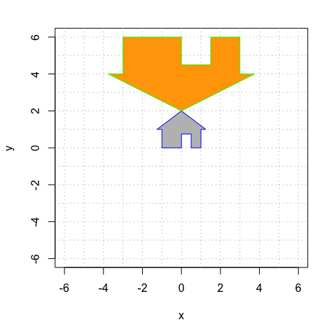

# 2D Translations with Homogeneous Coordinates

[Download this Rmd file](https://github.com/mathbeveridge/math236_f20/blob/main/04-translations.Rmd)

A **translation** of the plane shifts every vector by a constant vector. For example, the mapping
$$
S \left( \begin{bmatrix} x \\ y \end{bmatrix} \right)
= \begin{bmatrix} x \\ y \end{bmatrix} + \begin{bmatrix} 3 \\ -4 \end{bmatrix} 
= \begin{bmatrix} x +3 \\ y - 4 \end{bmatrix}
$$
translates every vector in the plane by $\begin{bmatrix} 3 \\ -4~ \end{bmatrix}$. 

**The bad news:** This is a simple and natural mapping, but it is **not a linear transformation**! We know that a linear transformation must map $\mathbb{0}$ to $\mathbb{0}$, and that is certainly not the case when we translate! This restriction is rather limiting for computer graphics: we can never move our image away from the origin. 

**The good news:** We can work around this problem by creating a 3D linear transformation $T: \mathbb{R}^3 \rightarrow \mathbb{R}^3$ and then retricting our attention to a plane in this larger space.
As discussed in the Homogeneous Coordinates video, we do the following:

1. Embed the $xy$-plane $\mathbb{R}^2$ into the plane $z = 1$ in $\mathbb{R}^3$. 
2. Translate in $\mathbb{R}^3$ using a mapping $T$ that maps this horizontal plane to itself. That is:
$$
T \left( \begin{bmatrix} x \\ y \\ 1 \end{bmatrix} \right)
= \begin{bmatrix} u \\ v \\ 1 \end{bmatrix}. 
$$
3. When we create our plot, we use **only the first two coordinates** and ignore the third coordinate (which is still 1).

In summary, during our calculations, we replace the vector $\begin{bmatrix} x \\ y  \end{bmatrix}$ in $\mathbb{R}^2$ with the **homogeneous coordinate vector** $\begin{bmatrix} x \\ y \\ 1 \end{bmatrix}$ in $\mathbb{R}^3$.

## Translation 


Here is my house once again. Note that we have add $z=1$ as the third coordinate to each point. However, when plotting, we only use the first two coordinates.

```{r,homogeneous1,fig.height=4,fig.width=4, echo=TRUE}
# the third entry always = 1
house = cbind(c(0,0,1), c(0,3/4,1), c(1/2,3/4,1), c(1/2,0,1), c(1,0,1), c(1,1,1), c(5/4,1,1), c(0,2,1), c(-5/4,1,1), c(-1,1,1), c(-1,0,1), c(0,0,1));

# only plot the first two coordinates
plot(house[1,],house[2,],type="n",xlim=c(-6,6),ylim=c(-6,6),xlab="x",ylab="y")
abline(h=-6:6, v=-6:6, col="gray", lty="dotted")
polygon(house[1,], house[2,], col = "gray", border = "blue")
```


Next, we translate by $\begin{bmatrix} 3 \\ - 4 \end{bmatrix}$  by using the linear transformation
$$
T \left( \begin{bmatrix} x \\ y \\ z \end{bmatrix} \right)
= \begin{bmatrix} 1 & 0 & 3  \\ 0 & 1 & -4 \\ 0 & 0 & 1 \end{bmatrix} 
\begin{bmatrix} x \\ y \\ z \end{bmatrix}.
$$
Let's check that this has the desired effect on a homogeneous coordinate vector:
$$
T \left( \begin{bmatrix} x \\ y \\ 1 \end{bmatrix} \right)
= \begin{bmatrix} 1 & 0 & 3  \\ 0 & 1 & -4 \\ 0 & 0 & 1 \end{bmatrix} 
\begin{bmatrix} x \\ y \\ 1 \end{bmatrix}
=
\begin{bmatrix} x+3 \\ y - 4 \\ 1 \end{bmatrix}.
$$
It worked! Note that **this linear transformation maps every horizontal plane to itself**. For the plane $z=1$ (and only for this plane!) we get the exact translation that we desire. So it is **crucial** that $z=1$. That's the magic of homogeneous coordinates.

Let's do this calculation in R and plot the first two coordiantes:

```{r,homogeneous2,fig.height=4,fig.width=4, echo=TRUE}

A = cbind(c(1,0,0),c(0,1,0),c(3,-4,1))

house2 = A %*% house

# only plot the first two coordinates
plot(house[1,],house[2,],type="n",xlim=c(-6,6),ylim=c(-6,6),xlab="x",ylab="y")
abline(h=-6:6, v=-6:6, col="gray", lty="dotted")
polygon(house[1,], house[2,], col = "gray", border = "blue")
polygon(house2[1,], house2[2,], col = "pink", border = "black")
```

## Translation and then Rotation

We know plenty 2D linear transformation, including rotation, reflection  and shear mappings. We can turn any of them into a 3D transformation by appending a row and a column with a 1 in the lower right corner and  zero everywhere else. For example, the 2D rotation
$$
\begin{bmatrix} \cos \theta & -\sin \theta~   \\ \sin \theta & \cos \theta \end{bmatrix} 
$$
becomes the 3D transformation
$$
\begin{bmatrix} \cos\theta & -\sin\theta~ & 0   \\ \sin\theta & \cos\theta  &0 \\ 0 & 0 & 1 \end{bmatrix}. 
$$
This mapping rotates 3D space around the $z$-axis.

So let's combine two operations: a translation and a rotation.  First, let's translate by $\begin{bmatrix} -2 \\ 1 \end{bmatrix}$ and then rotate counterclockwise by $2 \pi/3$. And remember: the matrix **closest** to the vector acts first. So if we want to translate first, the translation matrix needs to be to the right of the rotation matrix:


$$
T \left( \begin{bmatrix} x \\ y \\ z \end{bmatrix} \right)
= 
\begin{bmatrix} \cos \frac{2\pi}{3} & -\sin\frac{2\pi}{3}~ & 0  \\ \sin\frac{2\pi}{3} & \cos\frac{2\pi}{3} & 0 \\ 0 & 0 & 1 \end{bmatrix} 
\begin{bmatrix} 1 & 0 & -2  \\ 0 & 1 & 1 \\ 0 & 0 & 1 \end{bmatrix} 
\begin{bmatrix} x \\ y \\ z \end{bmatrix}.
$$

```{r,homogeneous3,fig.height=5,fig.width=5}


translate = cbind(c(1,0,0),c(0,1,0),c(-2,1,1))
translate

t = 2*pi/3
rot = cbind(c(cos(t),sin(t),0),c(-sin(t),cos(t),0),c(0,0,1)) 
rot

A =   rot %*% translate 
A # display A
house3 = A %*% house

plot(house[1,],house[2,],type="n",xlim=c(-6,6),ylim=c(-6,6),xlab="x",ylab="y")
abline(h=-6:6, v=-6:6, col="gray", lty="dotted")
polygon(house[1,], house[2,], col = "gray", border = "blue")
polygon(house3[1,], house3[2,], col = "green", border = "black")
```

## Rotation and then Translation 

Let's **reverse the order** of these matrices and see that we get a **different transformation**.


```{r,homogeneous4,fig.height=5,fig.width=5}


A = translate %*% rot
A # display A
house3 = A %*% house

plot(house[1,],house[2,],type="n",xlim=c(-6,6),ylim=c(-6,6),xlab="x",ylab="y")
abline(h=-6:6, v=-6:6, col="gray", lty="dotted")
polygon(house[1,], house[2,], col = "gray", border = "blue")
polygon(house3[1,], house3[2,], col = "cyan", border = "black")
```

Indeed, these two transformations are different! So the order matters.


## Your Turn  

Here are a couple of plots that you should try to reproduce using homogeneous coordinates.

### House of Orange

Here is a picture of a gray house and a larger, upside-down orange house. **Work as a group** to reproduce this image using homogeneous coordinates. 


{width=50%}

You will have to use a combination of translation, rotation, and expansion.  You will do this by multiplying three matrices. **Think carefully and experiment.** Remember that the order of your matrices matters, and the rightmost one happens first. 

```{r,homogeneous5,fig.height=5,fig.width=5,echo=TRUE}
#############################
# your code defining the 3x3 matrices A1 and A2 
A1 = cbind(c(1,0,0), c(0,1,0), c(0,0,1))
A2 = cbind(c(1,0,0), c(0,1,0), c(0,0,1))
A3 = cbind(c(1,0,0), c(0,1,0), c(0,0,1))

A = A3 %*% A2 %*% A1


#############################
# you do not need to change this code
plot(house[1,],house[2,],type="n",xlim=c(-6,6),ylim=c(-6,6),xlab="x",ylab="y")
house2 = A %*% house
abline(h=-6:6, v=-6:6, col="gray", lty="dotted")
polygon(house2[1,], house2[2,], col = "orange", border = "green")
polygon(house[1,], house[2,], col = "gray", border = "blue")
```

### House Party

Here is a plot of the grey house and four other houses, colored cyan, red, gold and green. Reproduce this image using homogeneous coordinates. **Work as a group! You can collaborate, or divide and conquer.** Be ready to help one another out!


{width=50%}

```{r,homogeneous6,fig.height=5,fig.width=5,echo=TRUE}

#############
# your code for 3x3 matrices that create the transformed houses goes here 
A.red = cbind(c(1,0,0), c(0,1,0), c(0,0,1))

A.purple = cbind(c(1,0,0), c(0,1,0), c(0,0,1))

A.gold = cbind(c(1,0,0), c(0,1,0), c(0,0,1))

A.cyan = cbind(c(1,0,0), c(0,1,0), c(0,0,1))


####################
# you do not need to change this code
house = cbind(c(0,0,1), c(0,3/4,1), c(2/4,3/4,1), c(2/4,0,1), c(4/4,0,1), c(4/4,4/4,1), c(5/4,4/4,1), c(0,8/4,1), c(-5/4,4/4,1), c(-4/4,4/4,1), c(-4/4,0,1), c(0,0,1));


plot(house[1,], house[2,], type = "n", xlim=c(-2.5,2.5),ylim=c(-2.0,3.0),,xlab="x",ylab="y")
abline(h=-4:4, v=-4:4, col="gray", lty="dotted")

house.gold = A.gold %*% house
polygon(house.gold[1,], house.gold[2,], col = "gold", border = "blue")

house.cyan = A.cyan %*% house
polygon(house.cyan[1,], house.cyan[2,], col = "cyan", border = "blue")

house.red = A.red %*% house
polygon(house.red[1,], house.red[2,], col = "red", border = "blue")

house.purple= A.purple %*% house
polygon(house.purple[1,], house.purple[2,], col = "purple", border = "blue")

polygon(house[1,], house[2,], col = "gray", border = "blue")

```

