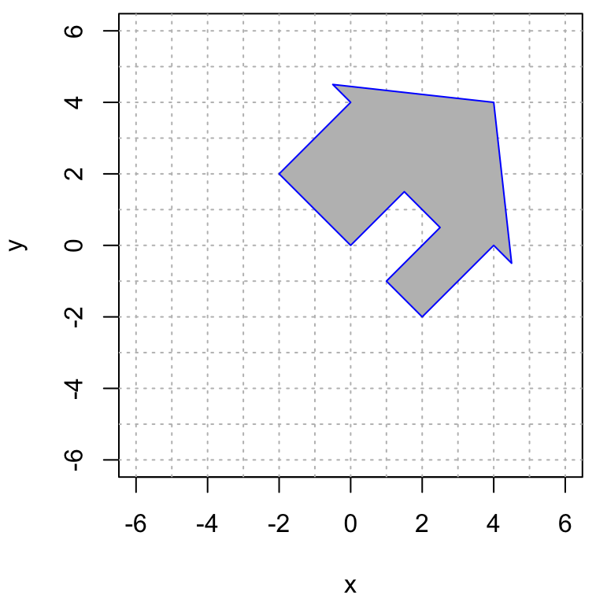
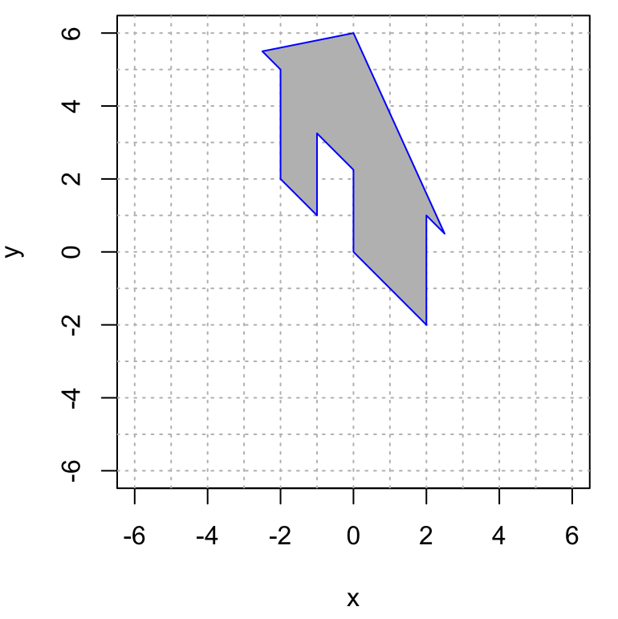

# Problem Set 3

* Due: Tuesday November 10 by 11:55pm CST. 
* Upload your solutions to Moodle in a PDF. 
* Please feel free to **use RStudio for all row reductions.**
* You can download the [Rmd source file  for this problem set](https://github.com/mathbeveridge/math236_f20/blob/main/PS3-problem-set-3.Rmd).

The Problem Set covers sections 1.7, 1.8, 1.9.


```{r setup, include=FALSE}
library(knitr)
opts_chunk$set(echo = FALSE,
               out.width = "75%", 
               fig.align = "center")
```

```{r, echo=FALSE}
require(pracma)
```


##  Three vectors in $\mathbb{R}^4$

\item Consider the vectors $\mathbf{u}$, $\mathbf{v}$, and $\mathbf{w}$ given by 
$$
 \qquad
\mathbf{u} = \begin{bmatrix} 1 \\  0 \\   2 \\  -1 \end{bmatrix}, \qquad
\mathbf{v} = \begin{bmatrix} 2 \\ -1 \\  3 \\  1 \end{bmatrix}, \qquad
\mathbf{w} = \begin{bmatrix} 1 \\  -2 \\   2 \\ 1 \end{bmatrix}.
$$
Use RStudio to answer the following questions. 

  1. Are $\mathbf{u}$, $\mathbf{v}$, and $\mathbf{w}$ linearly independent?
  
  1. Is the vector $\mathbf{b} = \begin{bmatrix} 4 \\ 4 \\  2 \\  4 \end{bmatrix}$   in the span  of vectors $\mathbf{u}$, $\mathbf{v}$, and $\mathbf{w}$?
  
  1. Is  the vector $\mathbf{b} = \begin{bmatrix} 2 \\ 1 \\  3 \\  1 \end{bmatrix}$ in the span  of vectors $\mathbf{u}$, $\mathbf{v}$, and $\mathbf{w}$?


## A Balanced Diet
  
<!-- https://lvs.com.au/wp-content/uploads/2015/10/protein-fat-carb-counter.pdf -->

An athlete wants to consume  a daily diet of 200 grams of carbohydrates, 160 grams of  proteins and 60 grams of fats. Here are some of their favorite foods.


```{r}
food.data <- data.frame(
   food = c ("almonds", "avocado",  "beans", "bread", "cheese", "egg", "milk", "zucchini"),
   carbs = c(3,15,20,12,1,1,12,6),
   fats = c(8,31,1,1,5,5,8,0), 
   proteins = c(5,4,8,2,3,6,8,2)
)

knitr::kable(
  food.data, booktabs = TRUE,
  caption = 'Food Carb/Fat/Protein (grams)'
)
```

Answer the following  questions, using RStudio for your calculations. Each response must use **two or more** of the following terms:  linear combination, span, linearly dependent, linearly independent. 


1. Explain why they **cannot** achieve their daily goal by eating only almonds, milk and zucchini.

2. Explain why they **cannot** acheive their daily goal by eating only almonds, beans and cheese.

3. Find a valid one-day diet consisting of avocado, beans, and bread. 


## A Problem about Span and Linear Dependence

Let $\mathsf{v}_1, \mathsf{v}_2, \mathsf{v}_3$ and  $\mathsf{w}_1, \mathsf{w}_2, \mathsf{w}_3, \mathsf{w}_4$ all be vectors in $\mathbb{R}^4$. Suppose that $\{ \mathsf{v}_1, \mathsf{v}_2, \mathsf{v}_3 \}$ is a linearly independent set, and that
$$
\mathrm{span}(\mathsf{v}_1, \mathsf{v}_2, \mathsf{v}_3) 
=
\mathrm{span}(\mathsf{w}_1, \mathsf{w}_2, \mathsf{w}_3, \mathsf{w}_4).
$$
Prove that $\mathsf{w}_1, \mathsf{w}_2, \mathsf{w}_3, \mathsf{w}_4$ must be linearly dependent.
You can do this by either:

* Explaning why there must be a nontrivial linear combination $c_1 \mathsf{w}_1 + c_2 \mathsf{w}_2 + c \mathsf{w}_3 + c \mathsf{w}_4 = \mathbf{0}$, or
* Showing that the $4 \times 4$ matrix $\begin{bmatrix} \mathsf{w}_1 & \mathsf{w}_2 & \mathsf{w}_3 & \mathsf{w}_4 \end{bmatrix}$ does not have a pivot in every column.


## Properties of Linear Transformations
Here are the row reductions to reduced row echelon form of 4 matrices.
$$
\begin{array}{ll}
A \longrightarrow \begin{bmatrix} 1 & 0 & 5 & -3 & 0\\ 0 & 1 & -2 & 8  & 0 \\ 0 & 0 & 0 & 0 & 1  \\ 0 & 0 & 0 & 0 &  0 \\ 0 & 0 & 0  & 0 &  0 \end{bmatrix} \qquad
& 
B \longrightarrow \begin{bmatrix} 1 & 0 & 0 & 0 \\ 0 & 1 & 0 & 0 \\ 0 & 0 & 1 & 0 \\ 0 & 0 & 0 & 1 \\ 0 & 0 & 0 & 0 \end{bmatrix} 
\\
\\
C \longrightarrow \begin{bmatrix} 1 & 0 & 0 & 0 \\ 0 & 1 & 0  & 0 \\ 0 & 0 & 1 & 0  \\ 0 & 0 & 0 &  1 \end{bmatrix}
&
D \longrightarrow \begin{bmatrix} 1 & 0 & 0 & 0  \\ 0 & 1 & 0  & 0  \\ 0 & 0 & 1 & 1   \end{bmatrix} 
\end{array}
$$

In each case, if $T$ is the linear transformation given by the matrix product $T(x) = M x$, where $M$ is an $m \times n$ matrix ($m$ rows and $n$ columns) then $T: \mathbb{R}^n \to \mathbb{R}^m$ is a transformation from domain $\mathbb{R}^n$ to codomain (aka target) $\mathbb{R}^m$. 

Determine the appropriate values for $n$ and $m$, and decide whether $T$ is one-to-one and/or onto. Submit your answers in table form, as shown below.
$$
\begin{array} {|c|c|c|c|c|} 
\hline
\text{matrix } M &  n  &  m & \text{one-to-one?} & \text{onto?} \\ \hline
A &\phantom{\Big\vert XX}&\phantom{\Big\vert XX}&& \\ \hline
B &\phantom{\Big\vert XX}&&& \\ \hline
C &\phantom{\Big\vert XX}&&& \\ \hline
D &\phantom{\Big\vert XX}&&& \\ \hline
\end{array} \hskip5in
$$


## Partial Information about a linear transformation

$T: \mathbb{R}^4 \rightarrow \mathbb{R}^3$ is a linear transformation such that: 
$$
T\left(\begin{bmatrix} 1 \\ 2 \\ 2 \\ 0 \end{bmatrix} \right)
=
\begin{bmatrix}  ~4~ \\ -1~ \\ 2 \end{bmatrix}
\quad \mbox{and} \quad
T\left(\begin{bmatrix} 2 \\ -1~ \\ 1 \\ 3 \end{bmatrix} \right)
=
\begin{bmatrix} ~2~ \\ 6  \\ -1~ \end{bmatrix}
\quad \mbox{and} \quad
T\left(\begin{bmatrix} 3 \\ 0 \\ 2 \\ 2 \end{bmatrix} \right)
=
\begin{bmatrix} 6 \\ 5  \\ 1 \end{bmatrix}
$$

  1. Do we have enough information to  determine whether $T$ is one-to-one? If no, then explain why not. If yes, then do so, along with a justification.


  2. Do we have enough information to determin whether $T$ is onto? If no, then  explain why not. If yes, then do so, along with  a justification.


## House Renovations

Find the matrix of a linear transformation $T: \mathbb{R}^2 \to \mathbb{R}^2$ that performs the given transformation of my house. (Hint: use the base, the doorway and the peak of the roof as a guide.)

1. Transformation \#1

{width=40%} $\qquad \qquad$ {width=40%}


2. Transformation \#2

{width=40%} $\qquad \qquad$ {width=40%}


For your convenience, here is the code to make the original plot of the house.

```
par(pty="s")
house = cbind(c(0,0), c(0,3/4), c(1/2,3/4), c(1/2,0), c(1,0), c(1,1), c(5/4,1), c(0,2), c(-5/4,1), c(-1,1), c(-1,0), c(0,0));

plot(house[1,],house[2,],type="n",xlim=c(-6,6),ylim=c(-6,6),xlab="x",ylab="y", asp=1)
abline(h=-6:6, v=-6:6, col="gray", lty="dotted")
polygon(house[1,], house[2,], col = "gray", border = "blue")
```


