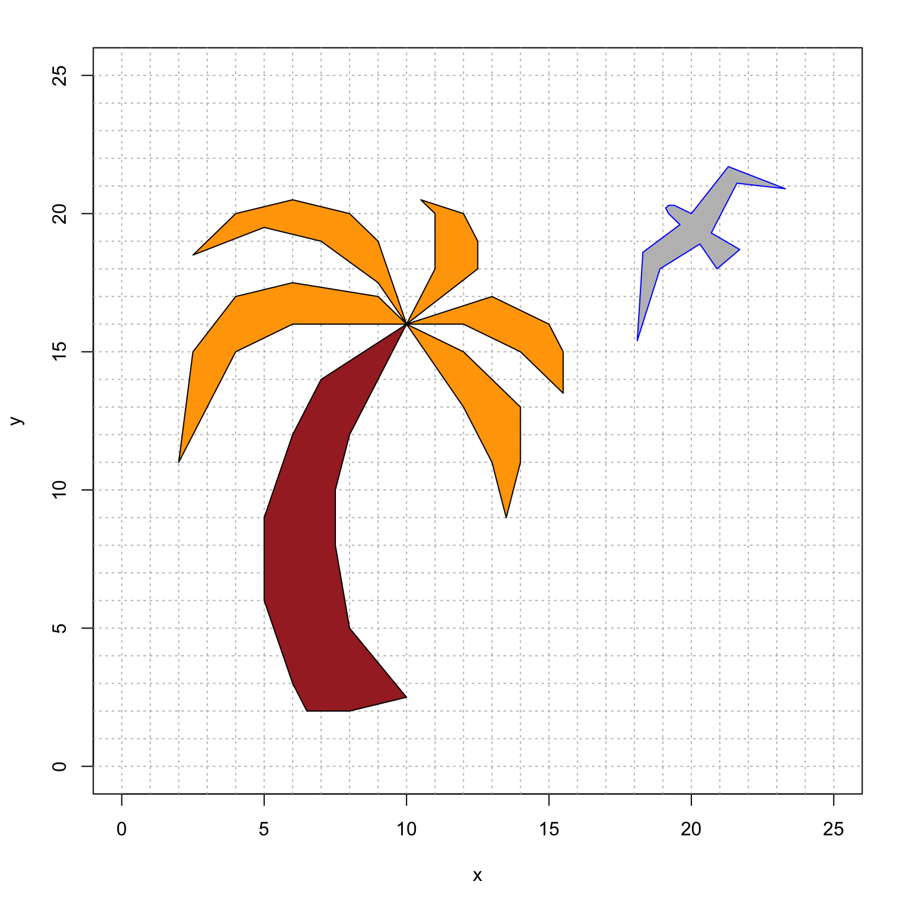
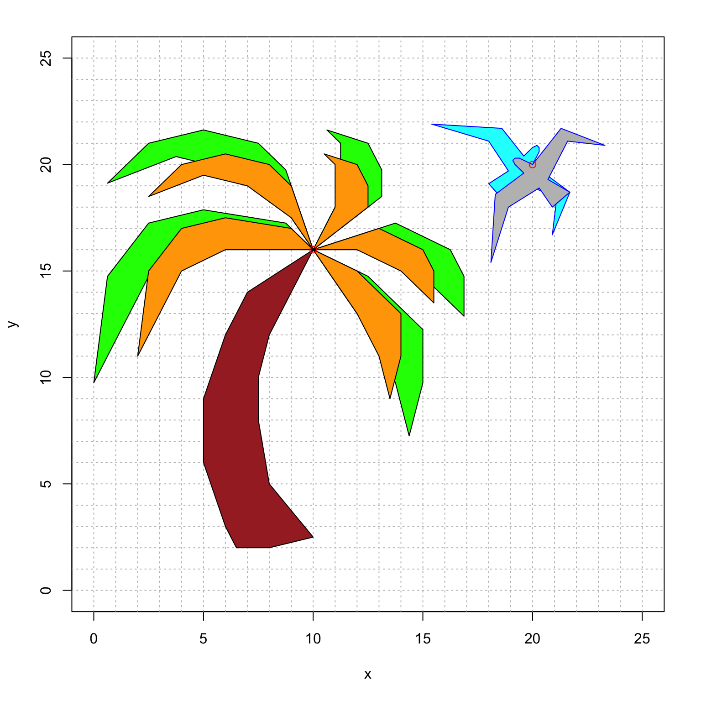

# Problem Set 4

* Due: Tuesday November 17 by 11:55pm CST. 
* Upload your solutions to Moodle in a PDF. 
* Please feel free to **use RStudio for all row reductions.**
* You can download the [Rmd source file  for this problem set](https://github.com/mathbeveridge/math236_f20/blob/main/PS4-problem-set-4.Rmd).
* Would you like use RMarkdown to type up some or all of your solution? Here is an [Rmd template file](https://github.com/mathbeveridge/math236_f20/blob/main/PS4-YourNameHere.Rmd) to get you started. You can "knit to PDF"  when you are done. Here are some helpful resources:
    + [RMarkdown Basics](https://rmarkdown.rstudio.com/authoring_basics.html)
    + [Math Typsetting using LaTeX syntax](https://www.math.mcgill.ca/yyang/regression/RMarkdown/example.html)
    + [The Rmd source for the problem set](https://github.com/mathbeveridge/math236_f20/blob/main/PS4-problem-set-4.Rmd) which has examples of  using `\begin{bmatrix} ... \end{bmatrix}` to format matrices.


The Problem Set covers sections 2.1,  2.2 and 2.3, and homogeneous coordinates.


## An Invertible Product of Rectangular Matrices

Suppose that  $m \neq n$ and  that $B$ is a $m \times n$ matrix and that $C$ is an $n \times m$ matrix where $A =BC$  is  an invertible matrix.

a. Is  $m > n$ or  is $m < n$? Explain.

b. Since $A$ is invertible, the Invertible Matrix Theorem tells us the following facts:
    * $A$ has a pivot in every row
    * $A$ has a pivot  in every column
    * $T(\mathsf{x})  = A\mathsf{x}$ is one-to-one
    * $T(\mathsf{x})  = A\mathsf{x}$ is onto
    * The columns of  $A$ span $\mathbb{R}^m$
    * The columns of $A$ are linearly independent
    * $A \mathsf{x} =\mathsf{b}$ has at least one  solution for all $\mathsf{b}$
    * $A \mathsf{x} =\mathbf{0}$ only has the trivial solution  

    What do these conditions guarantee about the $m \times n$ matrix $B$ and the $n \times m$ matrix $C$? Make the appropriate  list for  each of $B$ and $C$.


## Guessing the Inverse Matrix from a Pattern

a. Use RStudio to find the inverse matrix for each of the following matrices.

$$
\begin{bmatrix}
1 & 0 &  0  \\
1  & 1 & 0   \\
1  & 1 & 1  
\end{bmatrix}
\qquad
\begin{bmatrix}
1 & 0 &  0 & 0 \\
1  & 1 & 0  & 0   \\
1  & 1 & 1  & 0 \\
1  & 1 & 1  & 1 \\
\end{bmatrix}
\qquad
\begin{bmatrix}
1 & 0 &  0 & 0 & 0\\
1  & 1 & 0  & 0 & 0  \\
1  & 1 & 1  & 0 & 0\\
1  & 1 & 1  & 1 & 0\\
1  & 1 & 1  & 1 & 1\\
\end{bmatrix}.
$$
      by creating a matrix of the form $[ \, A \, | \, I \, ]$ and putting it into RREF to obtain $[ \, I \, | \, A^{-1} \, ]$.

b. Use the previous part to guess the inverse matrix $A^{-1}$ of  the $n \times n$ matrix

$$
A = 
\begin{bmatrix}
1 & 0 &  0 & 0 & \cdots &0&0 \\
1  & 1 & 0  & 0 & \cdots &0 &  0 \\
1  & 1 & 1  & 0 & \cdots & 0 & 0 \\
\vdots &  & & \ddots & & \vdots \\
1  & 1 & 1 & 1 & \cdots & 1 &   0 \\ 
1  & 1 & 1 & 1 & \cdots & 1 &   1 
\end{bmatrix}.
$$

c. Use this same method to guess the inverse matrix $B^{-1}$ for the $n \times n$ matrix
$$
B = 
\begin{bmatrix}
1 & 0 &  0 & 0 & \cdots & 0 & 0 \\
2  & 2 & 0  & 0 & \cdots & 0 & 0 \\
3  & 3 & 3  & 0 & \cdots & 0 & 0 \\
\vdots &  & & \ddots & & \vdots \\
n-1  & n-1 & n-1 & n-1 & \cdots & n-1 &  0 \\
n  & n & n & n & \cdots & n &  n 
\end{bmatrix}.
$$
**Pro Tip:** when R displays a number with a **large** negative exponent like `3.700743e-17` then this number  is $3.700743 \times 10^{-17}$  which is numerically equivalent to 0.


## LU Decomposition of an Invertible Matrix

Let $A$ be a $4 \times  4$ invertible matrix. Recall that if we run Gaussian Elimination on 
$[ \, A \,  | \, I \, ]$
until the first part is the RREF of matrix $A$, then we get the matrix 
$[ \, I \,  | \, A^{-1} ]$. 
In other words, this procedue is how we calculate $A^{-1}$. 

But what if we stop this process at the REF of matrix $A$? Let's call this resulting matrix 
$[ \, B  \,  | \, C \, ]$   
where $B$ is the RREF of $A$ where all the pivots are 1, so $B$ looks like
$$
B = \begin{bmatrix}
1 & b_{12} & b_{13}& b_{14}  \\
0 & 1 & b_{23} & b_{24}  \\
0 & 0 & 1 & b_{34}  \\
0 & 0 & 0 & 1  \\
\end{bmatrix}
$$
**Remark:** B is an example of an invertible **upper triangular matrix**: all the entries below the diagonal are zero.

a. Assume that $A$ is a  $4 \times 4$ matrix such that Gaussian Elimination to  REF only uses two types of Elementary Row Operations: 
    
      * (E1)  Add a multiple of one row  to another
      * (E3) Multiply a row by a nonzero constant.
    
   Explain why $C$ has the the form
      $$
      C = \begin{bmatrix}
       c_{11} & 0 & 0 &  0   \\
      c_{21} & c_{22} & 0 & 0  \\
      c_{31} & c_{32} & c_{33} & 0  \\
      c_{41} & c_{42} & c_{43}  & c_{44}  \\
      \end{bmatrix}
      $$
      
    where the diagonal elements $c_{11}, c_{22}, c_{33}, c_{44}$ are nonzero.

      
      **Remark:** C is an example of an invertible **lower triangular matrix**: all the entries above the diagonal are zero.

b. Explain why $CA=B$. 

c. Next, you  will show that the  inverse matrix $C^{-1}$ is also lower triangluar. Start with the matrix $[ \, C \, | \, I \, ]$ 
and perform Gaussian Elimination to put $C$ into RREF to get the matrix $[ \, I  \, | \,  C^{-1} ]$. 

    Considering the lower triangular structure of $C$, explain why putting $C$ into $REF$ actually results in the identity matrix $I$. 

d. Use the previous three parts to show that we can factor $A=LU$ where $L$ is an invertible lower triangular matrix and $U$ is an upper triangular matrix.


**Remark 1:** You proved this for a $4 \times 4$ matrix, but your argument also works for an $n \times n$ matrix.

**Remark 2:** If Gaussian Elimination of $A$ requires row operation (E2) "exchange two rows" then we can choose to do those row swaps first. This corresponds to multiplying $A$ by an invertible **permutation matrix** $P$. We then perform Gaussian Elimination on $PA$: we can factor $PA=LU$ where $L$ is lower triangular and $U$ is upper triangular. This is called the **$LU$-decomposition** of $A$. 

**Remark 3:** It turns out that explicitly calculating $A^{-1}$ can lead to some very problematic rounding errors. So most solvers use the $LU$-decomposition to solve $A \mathsf{x} = \mathsf{b}$ instead of calculating $\mathsf{x} = A^{-1}\mathsf{b}$. More specifically, we replace $A \mathsf{x} = \mathsf{b}$ with $LU \mathsf{x} = P^{-1} \mathsf{b}$ and then solve this in two steps.

* First, we solve $L \mathsf{y}  = P^{-1}\mathsf{b}$. Because $L$ is lower triangular, this runs exactly like ``back substitution.''
* Next, we solve $U \mathsf{x} = \mathsf{y}$.  Because $L$ is upper triangular, this also runs like ``back substitution.''

**Remark 4:** So what can go  wrong when computing $A^{-1}$? Sometimes an invertible matrix is   *ill-conditioned* which means that the rounding errors get in the way of the numerical calculation of the inverse. (Basically: you end up dividing by a number really close to 0.) The $LU$ methodology avoids this problem. You can learn more about this in MATH 365 Computational Linear Algebra. 


## Homogeneous Coordinates

I made the following nature scene with a bird and a palm tree.


```{r,bird1,fig.height=5,fig.width=5, echo=TRUE}

bird = rbind(c(20, 21.3, 23.3, 21.6, 20.7, 21.7, 20.9, 20.3, 18.9, 18.1, 18.3, 19.6, 19.2, 19.1, 19.2, 19.4, 20), 
             c(20, 21.7, 20.9, 21.1, 19.3, 18.7, 18, 18.9, 18, 15.4, 18.6, 19.6, 20, 20.2, 20.3, 20.3, 20), 
             c(1, 1, 1, 1, 1, 1, 1, 1, 1, 1, 1, 1, 1, 1, 1, 1, 1))

fronds = rbind(c(10, 8, 6, 4, 2, 2.5, 4, 6, 9, 10, 10, 9, 7, 5, 2.5, 4, 6, 8, 9, 10, 10, 11, 11, 10.5, 12, 12.5, 12.5, 10, 10, 13, 15, 15.5, 15.5, 14, 12, 10, 10, 12, 14, 14, 13.5, 13, 12, 10),
               c(16, 16, 16, 15, 11, 15, 17, 17.5, 17, 16, 16, 17.5, 19, 19.5, 18.5, 20, 20.5, 20, 19, 16, 16, 18, 20, 20.5, 20, 19, 18, 16, 16, 17, 16, 15, 13.5, 15, 16, 16, 16, 15, 13, 11, 9, 11, 13, 16),
               c(1, 1, 1, 1, 1, 1, 1, 1, 1, 1, 1, 1, 1, 1, 1, 1, 1, 1, 1, 1, 1, 1, 1, 1, 1, 1, 1, 1, 1, 1, 1, 1, 1, 1, 1, 1, 1, 1, 1, 1, 1, 1, 1, 1))

trunk = rbind(c(10, 9, 8, 7.5, 7.5, 8, 10, 8, 6.5, 6, 5, 5, 6, 7, 10),
              c(16, 14, 12, 10, 8, 5, 2.5, 2, 2, 3, 6, 9, 12, 14, 16),
              c(1, 1, 1, 1, 1, 1, 1, 1, 1, 1, 1, 1, 1, 1, 1))

# intialize the plot
plot(bird[1,],bird[2,],type="n",xlim=c(0,25),ylim=c(0,25),xlab="x",ylab="y")
abline(h=0:25, v=0:25, col="gray", lty="dotted")

# plot the bird, trunk and fronds
polygon(bird[1,], bird[2,], col = "gray", border = "blue")
polygon(fronds[1,], fronds[2,], col = "orange", border = "black")
polygon(trunk[1,], trunk[2,], col = "brown", border = "black")

```


<!-- {width=60%} -->

However, I've decided that I want to make some changes.

* I want to **rotate the bird** by  $-\pi/2$ around the point  $(20,20)$ where its head meets its wing.
* I want to **enlarge the fronds** (leaves) of the  plam tree to be bigger by $25\%$.
* I like the trunk just as it is (no changes!), so the fronds should still meet at the point $(10,16)$.
* I want to change  the colors to make it happier. 

For example, here is what I want it to look like (though maybe there is a better color choice).

{width=60%}

However, I'm not sure how to do this because:

* I only know how to rotate vectors around the point $(0,0)$. So how can I rotate around the point $(20,20)$?
* Likewise, I only know how to expand vectros from the point $(0,0)$. So how can I expand outward from the point $(10,16)$?

I heard someone say that translations via homogeneous coordinates will help to solve my problem. But I'm not sure what to do. Help!

Please submit:

* The numerical $3 \times 3$ matrix `birdmap` that you used for the bird, and an explanation of how you made it.
* The numerical $3 \times 3$ matrix `leafmap` that you used for the leaves, and an explanation of how you made it.
* Your resulting plot where you use happier [colors of your choice](http://www.stat.columbia.edu/~tzheng/files/Rcolor.pdf) that are **unique to you** and express your personal style. (An artist statement is optional.)


For your convenience, here is some template code for you. Once you fill in the proper transformation, this code  will make the final picture. Currently, it updates the colors, but  doesn't change  the bird or the fronds (because it is using the identity transformation).


```{r,bird2,fig.height=5,fig.width=5, echo=TRUE}

#####################
######## update this code with the appropriate linear transformations

birdmap = cbind(c(1,0,0),c(0,1,0),c(0,0,1))
leafmap = cbind(c(1,0,0),c(0,1,0),c(0,0,1))


#####################
######## you do not need to change this the code below this line

newbird = birdmap %*% bird
newfronds = leafmap %*% fronds


# initialize the plot
plot(newbird[1,],newbird[2,],type="n",xlim=c(0,25),ylim=c(0,25),xlab="x",ylab="y")
abline(h=0:25, v=0:25, col="gray", lty="dotted")

polygon(newbird[1,], newbird[2,], col = "cyan", border = "blue")
polygon(newfronds[1,], newfronds[2,], col = "green", border = "black")
polygon(trunk[1,], trunk[2,], col = "brown", border = "black")
```


Finally, here is some R code that might be helpful. It overlays the original and the new version, so that you can directly compare them. Here is what the final comparison should look like:

{width=60%}


```{r,bird3,fig.height=5,fig.width=5, echo=TRUE}
# initialize the plot
plot(newbird[1,],newbird[2,],type="n",xlim=c(0,25),ylim=c(0,25),xlab="x",ylab="y")
abline(h=0:25, v=0:25, col="gray", lty="dotted")

# plot the new bird and new fronds
polygon(newbird[1,], newbird[2,], col = "gray", border = "blue")
polygon(newfronds[1,], newfronds[2,], col = "orange", border = "black")

# plot the original bird, fronds  and trunk
polygon(bird[1,], bird[2,], col = "cyan", border = "blue")
polygon(fronds[1,], fronds[2,], col = "green", border = "black")
polygon(trunk[1,], trunk[2,], col = "brown", border = "black")

```


**Remark:** This truly is how computer animation works! We use different effects for each object, and need to use homogeneous coordinates to get our desired results.


