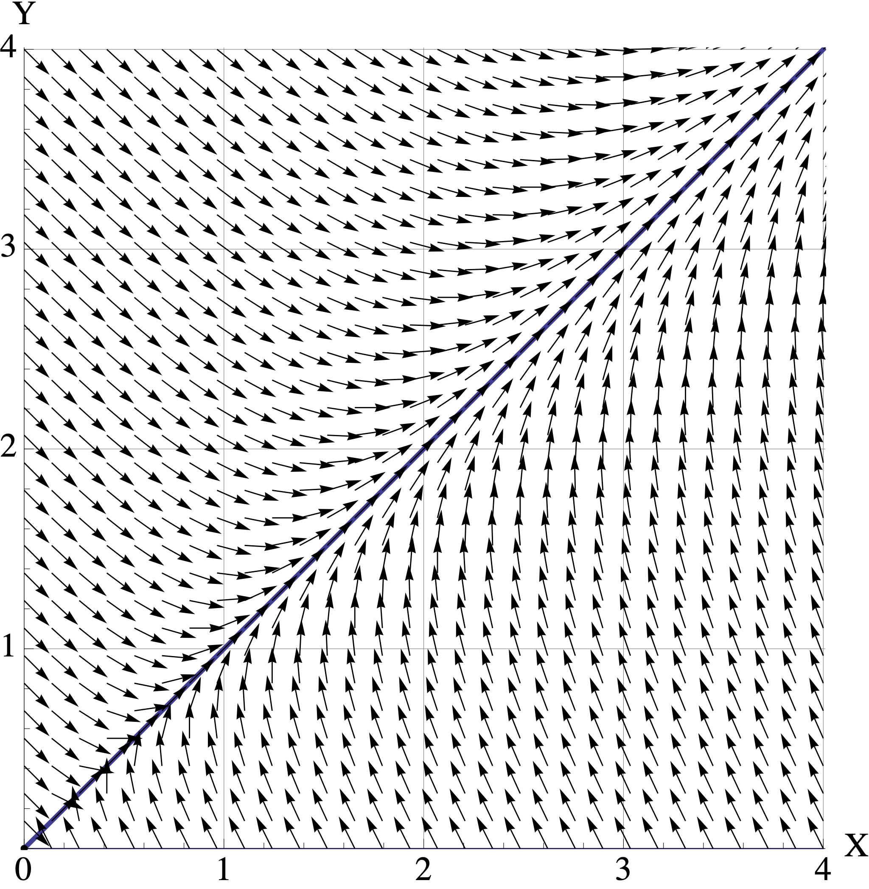

# Problem Set 7

* Due: Tuesday December 08 by 11:55pm CST. 
* Upload your solutions to Moodle in a PDF. 
* Please feel free to **use RStudio for all calculations, including row reduction, matrix multiplication, eigenvector calculation and inverse matrices.**
* You can download the [Rmd source file  for this problem set](https://github.com/mathbeveridge/math236_f20/blob/main/PS7-problem-set-7.Rmd).
* You can download a [Rmd template solution file](https://github.com/mathbeveridge/math236_f20/blob/main/PS7-template.Rmd). 

This problem set covers Sections 5.5 Complex Eigenvalues and 5.6 Dynamical Systems, as well as [Modeling of Ecological Systems][Modeling of Ecological Systems]. Three out of four questions require you to use RStudio. I've provided a [PS7 solution template](https://github.com/mathbeveridge/math236_f20/blob/main/PS7-template.Rmd) if you want to use it. 


## Glucose-Insulin System Model

**Note:** Use the functions `get_trajectory(A, start, N)` and `plot_trajectory(X, title, types)` from [Modeling of Ecological Systems](Modeling of Ecological Systems) to create trajectories and plots for this question.


The excess glucose level $G_t$ and excess insulin level $H_t$ in  a digestive system are determined by the update rule
$$
\begin{bmatrix} G_{t+1} \\  H_{t+1} \end{bmatrix}
=
\begin{bmatrix} 0.998 & -0.169 \\  0.068 & 0.930 \end{bmatrix}
\begin{bmatrix} X_{t} \\  Y_{t} \end{bmatrix}
=
\begin{bmatrix}
a X_t + b Y_t \\
 c X_t + d Y_t \\
 \end{bmatrix}
$$
  a. Suppose that we have an intake of glucose
$\begin{bmatrix} G_{0} \\  H_{0} \end{bmatrix} = \begin{bmatrix} 2 \\ 0 \end{bmatrix}.$  Make a plot of this system and that you can use to estimate how long it will take for this system to return (approximately) to homeostatis, where the values stay steady at $\begin{bmatrix} 0 \\ 0 \end{bmatrix}$.


  b. Calculate the eigenvalues $\lambda = a \pm b i$  for this matrix. Use them to find the decay rate $|\lambda| = \sqrt{a^2 +  b^2}$ and the rate of rotation
$\theta = \tan^{-1} (a/b)$,  measured in  degrees. You can find this value in RStudio using the command `atan(a/b) * 360 / (2 * pi)`.


## Population Interaction Models


The dynamics of two interacting populations $X$ and $Y$ can be modeled using a discrete dynamical system of the form
$$
\begin{bmatrix} X_{t+1} \\  Y_{t+1} \end{bmatrix}
=
\begin{bmatrix} a & b \\  c & d \end{bmatrix}
\begin{bmatrix} X_{t} \\  Y_{t} \end{bmatrix}
=
\begin{bmatrix}
a X_t + b Y_t \\
 c X_t + d Y_t \\
 \end{bmatrix}
$$
where $a,b,c,d$ are constants that depend on the type of interaction. 


The constants have the following interpretations:

```{r, echo=FALSE}


tabledata = rbind(c('$a$' , 'Does population $X$ thrive in the absence of population $Y$?' , 'If $a > 1$, then $X$ thrives without $Y$. If $0 < a < 1$ then $X$ dies out without $Y$.'),
      c('b', 'What is the effect of population $Y$ on population $X$?', 'If $b > 0$ then  $Y$ helps $X$ to thrive. If $b < 0$ then $Y$ hinders the population growth of $X$.'),
      c('c', 'What is the effect of population $X$ on population $Y$?', 'If $c > 0$ then  $X$ helps $Y$ to thrive. If $c < 0$ then $X$ hinders the population growth of $Y$.'),
      c('d', 'Does population $Y$ thrive in the absence of population $X$?', 'If $d > 1$, then $Y$ thrives without $X$. If $0 < d < 1$ then $Y$ dies out without $X$.')
)


tableframe = data.frame(tabledata)
names(tableframe) = c('constant', 'qualitative interpretation', 'quantitative interpretation')


knitr::kable(
  tableframe, booktabs = TRUE
)
```

Let's consider 3 different types of population interaction.

* **Predation**: one population feeds off the other. One example: foxes and rabbits.
* **Competition**: the populations compete for the same resources. One example: squirrels and chipmunks.
* **Mutual Symbiosis**: the populations play complementary roles. Both thrive or decline together. One example: bees and flowers.


You will characterize the constants corresponding to these interactions and then analyze some examples.  (Note: these population models are oversimplified, of course. We are interested in seeing how eigenvalues and eigenvectors help to make sense of these systems.)

a.  For each of the proposed models (predation, competition, mutual symbiosis), characterize the values for the constants $a,b,c,d$ by using the interpretations listed above. For example, you must decide whether $a>1$ or $0 < a < 1$ for each model.

Your  answer should be written in table form, as shown below.


```{r, echo=FALSE}


tabledata = rbind(c('predation', '\t\t', '\t\t', '\t\t', '\t\t'),
                  c('competition', '\t\t', '\t\t', '\t\t', '\t\t'),
                  c('symbiosis', '\t\t', '\t\t', '\t\t', '\t\t'))


tableframe = data.frame(tabledata)
names(tableframe) = c('model', 'a', 'b', 'c', 'd')


knitr::kable(
  tableframe, booktabs = TRUE
)
```


b. Here are three different population models, along with its eigenvalue and eigenvectors. For each one, you must decide whether it is  Predation, Competition or Symbiosis. Your answer will be three simple statements like "$M$ is predation."


    $A = \begin{bmatrix}1.1  & -0.2 \\ -0.3 & 1.2  \end{bmatrix}, \qquad \lambda_1 = 1.4 \mbox{ with } \mathsf{v}_1 = \begin{bmatrix} 1 \\ -1.5 \end{bmatrix}, \qquad \lambda_2 = 0.9 \mbox{ with } \mathsf{v}_2 = \begin{bmatrix} 1 \\ 1 \end{bmatrix}$
    
    $B = \begin{bmatrix}0.5  & 0.4 \\ -0.2 & 1.1  \end{bmatrix}, \qquad \lambda_1 = 0.9 \mbox{ with } \mathsf{v}_1 = \begin{bmatrix} 1 \\ 1 \end{bmatrix}, \qquad \lambda_2 = 0.7 \mbox{ with } \mathsf{v}_2 = \begin{bmatrix} 1 \\ 0.5 \end{bmatrix}$

    $C = \begin{bmatrix}0.8  & 0.3 \\ 0.4 & 0.7  \end{bmatrix}, \qquad \lambda_1 = 1.1 \mbox{ with } \mathsf{v}_1 = \begin{bmatrix} 1 \\ 1 \end{bmatrix}, \qquad \lambda_2 = 0.4 \mbox{ with } \mathsf{v}_2 = \begin{bmatrix} 1 \\ -0.75 \end{bmatrix}$


c. Here are  plots of the vector fields for the three models in part (b). Match the model $A, B, C$ to its corresponding vector field. Your answer will be three simple statements like "$M$ is Vector Field 2."

    i. Vector Field 1

    <center>    
    {width=40%} 


    </center>

    ii. Vector Field 2

    <center>    
    {width=40%}
    </center>

    iii. Vector Field 3

    <center>    
    {width=40%}
    </center>

d. For each matrix model $A,B,C$, assume that the initial population is $[X_0, Y_0]^{\top} = [1, 2.5]^{\top}$ where the units are in millions of organisms. Use the corresponding vector field to visualize the trajetory starting at $[1, 2.5]^{\top}$.

  - Describe the trajectory in words. (For example: "At first both populations decrease to $[0.5, 1]^{\top}$. But then they both start increasing and converge  to the direction of $[2,3]^{\top}$. They continue to grow forever." ) 
  - Indicate the long-term populations for both organisms (growth, stable, extinction). 
  - Connect the behavior you see back to the eigenvalues and eigenvectors of the model


##  Blue Whale Population Dynamics

**Note:** Use the helper code from [Modeling of Ecological Systems](Modeling of Ecological Systems) to create trajectories and plots for this question.


In the 1930's (before <a href="https://en.wikipedia.org/wiki/Blue_whale#Hunting_era">its virtual extinction and a great change in its survival rates</a>), a researcher studied the blue whale population. Due to the long gestation period, mating habits and migration of the blue whale, a female can produce a calf only once in a two-year period. Thus the age classes for the whale were assumed to be:

- 0-1 years
- 2-3 years
- 4-5 years
- 6-7 years
- 8-9 years
- 10-11 years
- 12 or more years

The Leslie Matrix  $B$ for this model is given by

```{r, echo=TRUE}
(L=rbind(c(0,0,.19,.44,.5,.5,.45),
         c(.77,0,0,0,0,0,0),
         c(0,.77,0,0,0,0,0),
         c(0,0,.77,0,0,0,0),
         c(0,0,0,.77,0,0,0),
         c(0,0,0,0,.77,0,0),
         c(0,0,0,0,0,.77,.78)))

```

We can see that the vector of fecundities is $[0,0,0.19,0.44,0.5,0.5,0.45]$, and that the survival rate for all whales 11 years old or younger is 77%, and for all whales 12 or more years, it is 78%.


a. Starting from a whale population of 1000 in each of the seven age classes, plot the trajectories over a 40 year period. Does your plot of this model predict population growth, population equilibrium or population extinction? 


b. Calculate the eigenvectors and eigenvalues of the matrix $L$. Relate the behavior you see to the eigenvalues and eigenvectors. 

      * What is the overall growth rate? 
      * What are the long-term population ratios?


c. When population is increasing, one might be interested in harvesting a portion of the population for some purpose. We want this harvest rate to be **sustainable**, meaning that the **total population remains at a constant level** in the long run. For simplicity, we will not distinguish between classes during the harvest (but this could be added with a minor modification). 

    If a fraction $h$ of the population is harvested each year, where $0 < h < 1$, then the population model becomes

    $${\bf x}_{t+1} = (1-h) L {\bf x}_t.$$

    - Use trial and error to find the sustainable harvest rate $h < 1$ **up to 4 decimal places** that leads to a stable population of whales.
    - Then plot a trajectory of this system with sustainable harvesting. Choose a long enough time peroid so that your plot shows that the blue whale populations reach a very stable configuration. 
    - In the long run, what are the percentages of whales in each age class? How does this compare to the population percentages you found in part (b)? Why does this make sense?


## The Power Method for Eigenvalue Calculation

During class, we found eigenvalues by solving the characteristic equation $\det(A−\lambda I) =0$. We then found the  eigenvectors by finding  a basis for $\mathrm{Nul}(A - \lambda I)$. This is fine for small matrices, but impractical for large ones. 

So let's see how computers find (or really: approximate) eigensystems. We will assume that all of the eigenvectors are real. If you want the full story, then you should take MATH 365 Computational Linear Algebra.

This problem explains how the Power Method and Inverse Power Methods work. 

* At certain points, **Your Task** is identified, and that is what you must turn in for this problem.
* Parts (a) and (c) will have you confirm that the code below works for the following $4 \times 4$ matrix. 

```{r, echo=TRUE}
A = cbind(c(4,2,4,8), c(2,2,4,4), c(4,4,9,1),c(8,4,1,5))

A

eigen(A)


```

* This problem is not supposed to be hard. If you crave more guidance or background while working on this problem, then you can compare to [ULA Section 5.2](http://merganser.math.gvsu.edu/david/linear.algebra/ula/ula/sec-power-method.html) and  Lay Section 5.8.

&nbsp;

a. **The Power Method.** We find the dominant eigenvalue and eigenvector by repeatedly multiplying some initial vector by $A$  until we converge to the dominant eigenspace. This should sound familiar: it's the same phenomenon that makes our dynamical systems converge!

    The one extra detail is that we rescale at each step: we adjust our eigenvector estimate so that its largest entry is 1. Here is the code. It is very simple.


```{r, echo=TRUE}

estimate_dominant_eigenvector <- function(A, numiter) {
  n = dim(A)[1]
  x = rep(1,n)
  
  for (i in 1:numiter) {
    y = A %*% x
    maxval = max(y)
    minval = min(y)
    
    if (abs(maxval) > abs(minval)) {
      m = maxval
    }  else {
      m = minval
    }
    
    x = y/m
  }
  
  est = 'estimate'
  attr(est,'value') = m
  attr(est, 'vector') = x
  
  return(est)
}
```


  **Your Task:** Run this code on the matrix $A$ and start with `numiter=5`. Then increase this value and watch the eigenvalue estimate converge to the dominant eigenvalue.

  - What is the smallest number of iterations needed so that the estimated eigenvalue  matches the eigenvalue returned by `eigen(A)` (up to 7 decimal places)? 
  - Write some code to compare the estimated eigenvector (whose largest entry is 1) with the eigenvector returned by `eigen(A)`. They should match when you rescale.  


&nbsp;


b. **The Inverse Power Method  Explained.** We can use the power method to find the other eigenvalues, too. Let's suppose that we are trying to find eigenvalue $\lambda$ with eigenvector $\mathsf{v}$. 

  We just need to start at a guess $c$ that is closer to $\lambda$ that to any of the other eigenvalue. In other words, if $\mu$ is any other eigenvale of $A$, we  have $| \lambda - c| < | \mu - c|.$
  
  Using our guess $c$, we define
$$
B = (A - c I)^{-1}.
$$
  And then we apply the power method to $B$. You will now show that (1) $A-cI$ really is invertible, and that (2) $\mathsf{v}$ is the dominant eigenvector of $B$.

  **Your Task:** answer the following four short questions. Each answer only requires a sentence or two.

  1. Suppose that $\mathsf{v}$ is an eigenvector of $A$ for eigenvalue $\lambda$. That is,  $A \mathsf{v} = \lambda \mathsf{v}$. Confirm that $\mathsf{v}$ is  an eigenvector for $A - cI$ for eigenvalue $\lambda - c$.
  
  1. Assume that our guess $c$ is not an eigenvalue of $A$. Prove that $A-cI$ is invertible by showing that $\mathrm{Nul}(A) = \mathbf{0}$.
  
  1. Now that we know that $B = (A - c I)^{-1}$ exists, explain why $\mathsf{v}$ is an eigenvector of $B$ for eigenvalue 
$\frac{1}{\lambda-c}.$

  1. A similar argument shows that all eigenvalues of $B$ are of the form $\frac{1}{\mu-c}$ where $\mu$ is an eigenvalue of $A$. So now use the fact that "$c$ that is closer to $\lambda$ that to any of the other eigenvalue" to explain why $\frac{1}{\lambda-c}$ is the dominant eigenvalue of $B$.


&nbsp;

c. **The Inverse Power Method in Practice.** In part (b), you showed why the inverse power method works! Now, here is the code, which is very simple. (**Remark:** in order to avoid rounding errors, in a true implementation, we would write code that avoids explicitly taking the inverse.)

```{r, echo=TRUE}
estimate_nearest_eigenvector <- function(A, c, numiter) {
  n = dim(A)[1]
  
  B = A - c * diag(n)
  Binv = solve(B)

  est = estimate_dominant_eigenvector(Binv, numiter)
  
  val = attr(est, 'value')
  newval = 1/val+c
  
  attr(est,'value') = newval
  
  return (est)
}

```

**Your Task:** Use this code to confirm that we can really find the other three eigenvectors for matrix $A$ above. 

  - Run this code using a guess for each of the 3 remaining eigenvalues. 
  - Confirm that this code does find the correct eigen vector and eigenvalue, provided that you run for enough iterations.
  - Write some code to compare the estimated eigenvectors (whose largest entry is 1) with the eigenvector returned by `eigen(A)`. They should match when you rescale. 


**Remark:** These two methods succeed in finding the complete eigensystem  when all of the eigenvalues are real. What do we do when there are complex eigenvalues? This is one of the reason why the `eigen()` command in RStudio actually uses another method called $QR$-decomposition to approximate eigensystems.
