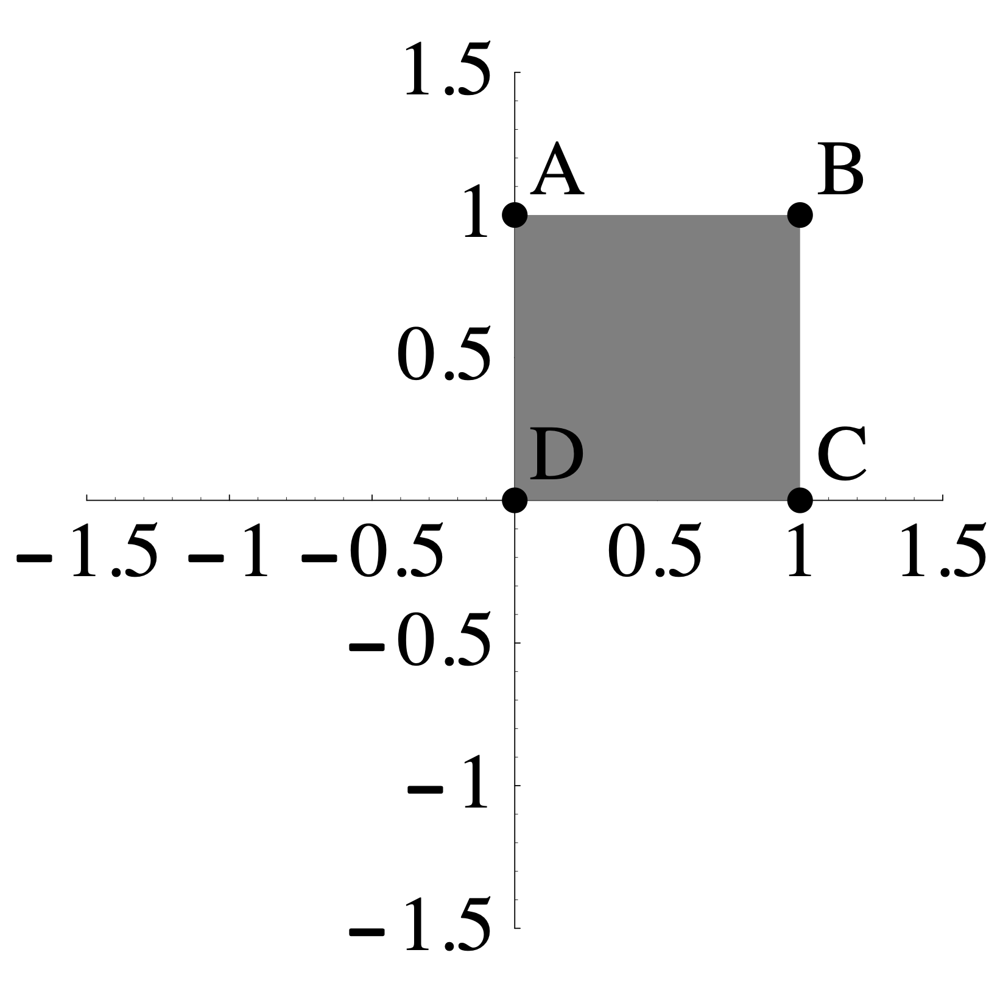
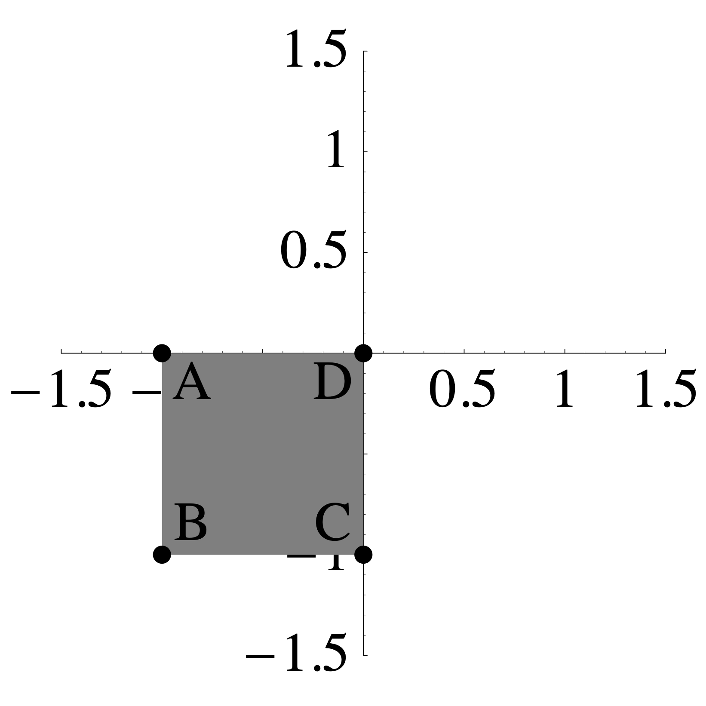

# (PART) Quiz Review {-}

# Quiz 1 Review

## Overview

### Vocabulary and Concepts

You should understand these concepts and be able to read and use these terms correctly:

* elementary row operations 
* REF and RREF
* pivot position
* linear combination
* span
* linear independence
* homogeneous and nonhomogeneous equations
* Understand the geometric relationship between the solutions to $Ax = 0$ and $Ax=b$
* Understand Theorem 4 in Section 1.4 which says that the following are equivalent (they are all true or are all false) for an $n \times m$ matrix $A$
    + For each $b$ in Rm, $A x = b$ has a solution
    + Each $b$ in $\mathbb{R}^m$ is a linear combination of the columns of $A$
    + The columns of $A$ span $\mathbb{R}^m$
    + $A$ has a pivot in every row.
* Understand Theorem 8 in Section 1.7: if you have more than n vectors in Rn they must be linearly dependent.
* linear transformation
* one-to-one and onto

### Skills

You should be able to perform these linear algebra tasks.

* Identify linear systems from nonlinear systems
* Make the augmented matrix from a set of equations
* Row reduce a system of equations into Row Echelon Form (REF) and Reduced Row Echelon Form (RREF)
* Write the solution set to Ax=b as a parametric vector equation.
* Convert back and forth between systems of equations, vector equations, and matrix equations.
* Compute the matrix-vector product $Ax$
* Determine whether a set of vectors is linearly dependent or independent
* Find a dependence relation among a set of vectors
* Decide if a set of vectors span Rn
* Manipulate matrix vector products using: $A(x + y) = Ax + Ay$ and $A(c x) = c A x$
* Determine whether a linear transformation is one-to-one and/or onto

## Practice Problems

<!-- ------------------ -->
1. I have performed some row operations below for you on a matrix $A$. Write out the complete set of solutions to $A \mathsf{x} = {\bf 0}$.
$$
A=
\begin{bmatrix}
1& 2& 0& 2& 0& -1 \\
1& 2& 1& 1& 0& -2 \\
2& 4& -2& 6& 1& 2 \\
1& 2&  0& 2& -1& -3 \\
\end{bmatrix} \longrightarrow
\begin{bmatrix}
1& 2& 0& 2& 0& -1\\
0& 0& 1& -1& 0& -1\\
0& 0& 0& 0& 1& 2\\
0& 0&   0& 0& 0& 0\\
\end{bmatrix}
$$   

2. I have performed some row operations below for you on a matrix $B$.
$$
B=
\begin{bmatrix}
1& 1& 0 \\ 0& 1& 1 \\ 2& 1& 2 \\ 1& -1& 1 \\ 2& 3& 1 \\
\end{bmatrix}
\longrightarrow
\begin{bmatrix}
1& 0& 0 \\ 0& 1& 0 \\ 0& 0& 1 \\ 0&0&0 \\ 0&0&0 \\
\end{bmatrix} 
$$
    a. Describe the solutions to the equation $B \mathsf{x} = {\bf 0}$.

    b. Fill in the boxes:   the transformation $T(\mathsf{x}) = B\mathsf{x}$ is a linear transformation from $\mathbb{R}^{\square}$ to $\mathbb{R}^{\square}$.

3. I want to know if it is possible to write $\mathsf{w}$ as a linear combination of the vectors $\mathsf{v}_1, \mathsf{v}_2, \mathsf{v}_3$ below. Write down,
**but do not solve**, a matrix equation that would solve this problem.  Your answer should be of the form $A \mathsf{x} = \mathsf{b}$, where I can clearly see what $A, \mathsf{x}$, and $\mathsf{b}$ are. I should also be able to tell how many unknowns there are.
$$
\mathsf{v}_1 = \left[ \begin{matrix} 1 \\  2 \\ 3 \\ 4 \\  \end{matrix}\right] ,  \quad
\mathsf{v}_2 = \left[ \begin{matrix} 1 \\  0 \\ 1 \\ 0 \\  \end{matrix}\right] ,  \quad
\mathsf{v}_3 = \left[ \begin{matrix} 1 \\  1 \\ 0 \\ -2 \\  \end{matrix}\right] ,  \quad
\mathsf{w} = \left[ \begin{matrix} 1 \\  -8 \\ -11 \\ -24 \\  \end{matrix}\right] . 
$$

4. Describe all vectors that are not in the span of the columns of the matrix $A$ below:
$$
A=
\begin{bmatrix}
1& 2& 4  \\
-3& -5& -11\\
1& 1& 3 \\
\end{bmatrix}
$$

5. The matrix below is $3 \times 3$ but the third column is missing.    Add a nonzero third column so that the columns of  $A$ are linearly dependent and add a 3rd column so that the columns of $A$ are linearly independent. Briefly describe your strategy.
$$
\begin{bmatrix}
1& 0 & \quad \\
0& 1& \quad \\
2& 2& \quad \\
\end{bmatrix}  \qquad\qquad 
\begin{bmatrix}
1& 0 & \quad \\
0& 1& \quad \\
2& 2& \quad \\
\end{bmatrix}
$$

6. In each case below, find the **matrix** of the linear transformation that is described, if you believe that the matrix exists. Otherwise, demonstrate that the transformation is **not linear**.  

    a. The transformation $T$ is given by:
    $$T \left( \begin{bmatrix}  x_1 \\ x_2 \\ \end{bmatrix}\right) = 
        \begin{bmatrix} x_1 + x_2 \\ 2 x_1 \\ -x_2 \\\end{bmatrix}.
    $$

    b. The transformation $T$ is given by:
    $$T \left( \begin{bmatrix}  x_1 \\ x_2 \\ x_3 \end{bmatrix} \right)= 
      \begin{bmatrix} x_1 + x_2 + x_3 \\  x_1 x_2 \\ -x_2 + 2 x_3 \end{bmatrix}.
    $$

   c. The transformation $L: \mathbb{R}^2 \to \mathbb{R}^2$ sends the shaded region on the  left to the the shaded region on the right such that $A$ maps to $A$, $B$ maps to $B$, $C$ maps to $C$, and $D$ maps to $D$.
    
{width=30%} $\qquad \qquad$ {width=30%} 
    
  d. The transformation $R: \mathbb{R}^2 \to \mathbb{R}^2$ sends the shaded region on the  left to the the shaded region on the right such that $A$ maps to $A$, $B$ maps to $B$, $C$ maps to $C$, and $D$ maps to $D$.

{width=30%} $\qquad \qquad$ {width=30%} 

7. Write the following systems of equations in vector and matrix form.

$$
\begin{array} {ccccccccccc}
5 x_1 &+& 3 x_2 &+& x_3 &+& 11 x_4 &-&  x_5 &=& 10 \\
4 x_1 &+& x_2 &+& 3 x_3 &+& 2 x_4 &+& 6 x_5 &=& 11 \\
- x_1 &+& 3 x_2 &-& 2 x_3 &+&  x_4 &+& 6 x_5 &=& 12 \\
\end{array} 
$$

8.  Let $\mathsf{v}_1, \mathsf{v}_2, \mathsf{v}_3, \mathsf{v}_4$ be the vectors in the  columns of the matrix $A$ below.
$$
A = \left[
\begin{array}{cccc}
 1 & 1 & 3 & 1 \\
 2 & 0 & 2 & 3 \\
 1 & 1 & 3 & 1 \\
 -1 & 0 & -1 & 0
\end{array}
\right]
\longrightarrow
\left[
\begin{array}{cccc}
 1 & 0 & 1 & 0 \\
 0 & 1 & 2 & 0 \\
 0 & 0 & 0 & 1 \\
 0 & 0 & 0 & 0
\end{array}
\right]
$$
    a. Are the vectors  $\mathsf{v}_1, \mathsf{v}_2, \mathsf{v}_3, \mathsf{v}_4$ linear independent or dependent? If they are linearly dependent, please give a dependence relation among them. 
    b. Describe the span of the vectors $\mathsf{v}_1, \mathsf{v}_2, \mathsf{v}_3, \mathsf{v}_4$ inside of $\mathbb{R}^4$?

9. Find a solution to $A \mathsf{x}=0$ that no one else in the class has.
$$
A = 
\begin{bmatrix}
 1 & 1 & 1 & 1 & 4 \\
 2 & 0 & 4 & 1 & 4 \\
 1 & 1 & 1 & 1 & 4 \\
 1 & 0 & 2 & 1 & 3
\end{bmatrix}
 \longrightarrow 
\begin{bmatrix}
 1 & 0 & 2 & 0 & 1 \\
 0 & 1 & -1 & 0 & 1 \\
 0 & 0 & 0 & 1 & 2 \\
 0 & 0 & 0 & 0 & 0
\end{bmatrix}
$$

10. Let $T: \mathbb{R}^n \to \mathbb{R}^m$ be a linear transformation.  Let $\mathsf{u}, \mathsf{v}, \mathsf{w}$ be a linearly independent set in $\mathbb{R}^n$, and suppose that $T(\mathsf{u}), T(\mathsf{v}), T(\mathsf{w})$ is a linearly dependent set in $\mathbb{R}^m$.

    a. State precisely what it means for $T(\mathsf{u}), T(\mathsf{v}), T(\mathsf{w})$ to be linearly dependent.
    b. Use the properties of a linear transformation to demonstrate that $T(\mathsf{x}) = \mathbf{0}$ has a nontrivial solution.

## Solutions to Practice Problems

1. The parametric vector form of the solution is 

$$\begin{bmatrix}
x_1 \\ x_2 \\ x_3 \\ x_4 \\ x_5 \\ x_6 \\
\end{bmatrix} = s \begin{bmatrix}
-2 \\ 1 \\ 0 \\ 0 \\0  \\ 0
\end{bmatrix}
+ t \begin{bmatrix}
-2 \\ 0 \\ 1 \\ 1 \\0  \\ 0
\end{bmatrix}
u \begin{bmatrix}
1 \\ 0 \\ 1 \\ 0 \\-2  \\ 1
\end{bmatrix}$$

2.

  a. There is one solution: $\mathsf{x} = \begin{bmatrix} 0 \\ 0 \\ 0 \end{bmatrix}$.
  b. The transformation $T(\mathsf{x}) = B\mathsf{x}$ is a linear transformation from $\mathbb{R}^{3}$ to $\mathbb{R}^{5}$.
  
3.
$$
\begin{bmatrix}
1 & 1 & 1 \\
2 & 0 & 1 \\
3 & 1 & 0 \\
4 & 0 & -2
\end{bmatrix}
\begin{bmatrix}
x_1 \\ x_2 \\ x_3
\end{bmatrix}
=
\begin{bmatrix}
1 \\ -8 \\ -11 \\ -24
\end{bmatrix}
$$

4.
$$
\left[ \begin{array}{ccc|c}
1& 2& 4 & b_1 \\
-3& -5& -11 & b_2\\
1& 1& 3 & b_3 \\
\end{array} \right]
\longrightarrow
\left[ \begin{array}{ccc|c}
1& 2& 4 & b_1 \\
0& 1& 1 & 3b_1 +b_2\\
0& -1& -1 & -b_1+b_3 \\
\end{array} \right]
\longrightarrow
\left[ \begin{array}{ccc|c}
1& 2& 4 & b_1 \\
0& 1& 1 & 3b_1 +b_2\\
0& 0& 0 & 2b_1+b_2+b_3 \\
\end{array} \right]
$$
So the set of target vectors that are not in the span of the columns of $A$ are the vectors
$$
\begin{bmatrix}
b_1 \\ b_2 \\ b_3
\end{bmatrix}
\qquad \mbox{where} \qquad
2b_1 + b_2 + b_3 \neq 0.
$$
5. There are lots of right answers to this one. In my first matrix, I will just add the first two columns to get the thrid column. Then I will add one to one to the bottom right entry of the matrix.
$$
\begin{bmatrix}
1& 0 & 1 \\
0& 1& 1 \\
2& 2& 4 \\
\end{bmatrix}  \qquad\qquad 
\begin{bmatrix}
1& 0 & 1 \\
0& 1& 1 \\
2& 2& 5 \\
\end{bmatrix}
$$
6. 
    a. This is a linear transformation with 
    $$A = \begin{bmatrix} 1 & 1 \\ 2 & 0 \\ 0 & -1 \end{bmatrix}.$$
    b. This is not a linear transformation because
    $$
    2 \, T \left( \begin{bmatrix} 1 \\ 1 \\ 1 \end{bmatrix} \right)= 2 \begin{bmatrix} 3 \\ 1 \\ 1 \end{bmatrix} = \begin{bmatrix} 6 \\ 2 \\ 2 \end{bmatrix} \quad \mbox{while} \quad 
    T \left( \begin{bmatrix} 2 \\ 2 \\ 2 \end{bmatrix} \right)= 2 \begin{bmatrix} 6 \\ 4 \\ 2 \end{bmatrix}.
    $$
    c. $A= \begin{bmatrix} 1/2 & 1/2 \\ 1/2 & 1/2 \end{bmatrix}$
  
    d. $A= \begin{bmatrix} 0 & -1 \\ -1 & 0 \end{bmatrix}$
  
7. Vector Form:
$$
x_1 \begin{bmatrix} 5 \\ 4 \\ -1 \end{bmatrix} + 
x_2 \begin{bmatrix} 3 \\ 1 \\ 3 \end{bmatrix} + 
x_3 \begin{bmatrix} 1 \\ 3 \\ -2 \end{bmatrix} + 
x_4 \begin{bmatrix} 11 \\ 2 \\ 1 \end{bmatrix} + 
x_5 \begin{bmatrix} -1 \\ 6 \\ 6 \end{bmatrix} =
 \begin{bmatrix} 10 \\ 11 \\ 12 \end{bmatrix} 
$$
Matrix Form:
$$
\begin{bmatrix} 
5 & 3 & 1 & 11 & -1 \\
4 & 1 & 3 & 2 & 6 \\
-1 & 3 & -2& 1 & 6
\end{bmatrix} 
 \begin{bmatrix} x_1 \\ x_2 \\ x_3 \\ x_4 \\ x_5 \end{bmatrix} 
 =
 \begin{bmatrix} 10 \\ 11 \\ 12 \end{bmatrix} 
$$

8.
    a. $-\mathsf{v}_1 - 2\mathsf{v}_2 + \mathsf{v}_3 + 0 \mathsf{v}_4 = 0$.
    b. $\mathrm{span}(\mathsf{v}_1,\mathsf{v}_2,\mathsf{v}_3,\mathsf{v}_4)$ looks like a copy of $\mathbb{R}^3$ sitting inside $\mathbb{R}^4$. In other words, is 3-dimensional subset of $\mathbb{R}^4$. 
    
9. The general solution is
    $$
    \begin{bmatrix}
    x_1 \\ x_2 \\ x_3 \\ x_4 \\ x_5
    \end{bmatrix}
    = s \begin{bmatrix} -2 \\ 1 \\ 1 \\ 0 \\ 0 \end{bmatrix}
    + t \begin{bmatrix} -1 \\ -1 \\ 0 \\ -2 \\ 1 \end{bmatrix}.
    $$
    My solution is
    $$77,083,679 
    \begin{bmatrix}
    -2 \\ 1 \\ 1 \\ 0 \\ 0
    \end{bmatrix}
    - 72,159,215 
    \begin{bmatrix}
    -1 \\ -1 \\ 0 \\ -2 \\ 1
    \end{bmatrix}.
    $$

10.
    a. There are scalars $c_1, c_2, c_3$ not all zero such that $c_1 T(\mathsf{u}) + c_2 T(\mathsf{v}) + c_3 T(\mathsf{w}) = \mathbf{0}$.
    b. We have
    $$
    \mathbf{0} = c_1 T(\mathsf{u}) + c_2 T(\mathsf{v}) + c_3 T(\mathsf{w}) =
     T(c_1 \mathsf{u} + c_2 \mathsf{v}+ c_3 \mathsf{w})
    $$
    However, we know that $\mathsf{u}, \mathsf{v},\mathsf{w}$ are linearly independent, so 
    $$
    c_1 \mathsf{u} + c_2 \mathsf{v}+ c_3 \mathsf{w} \neq \mathbf{0}.
    $$
    So this is a nonzero vector that maps to the zero vector. Therefore $T$ is not one-to-one.
