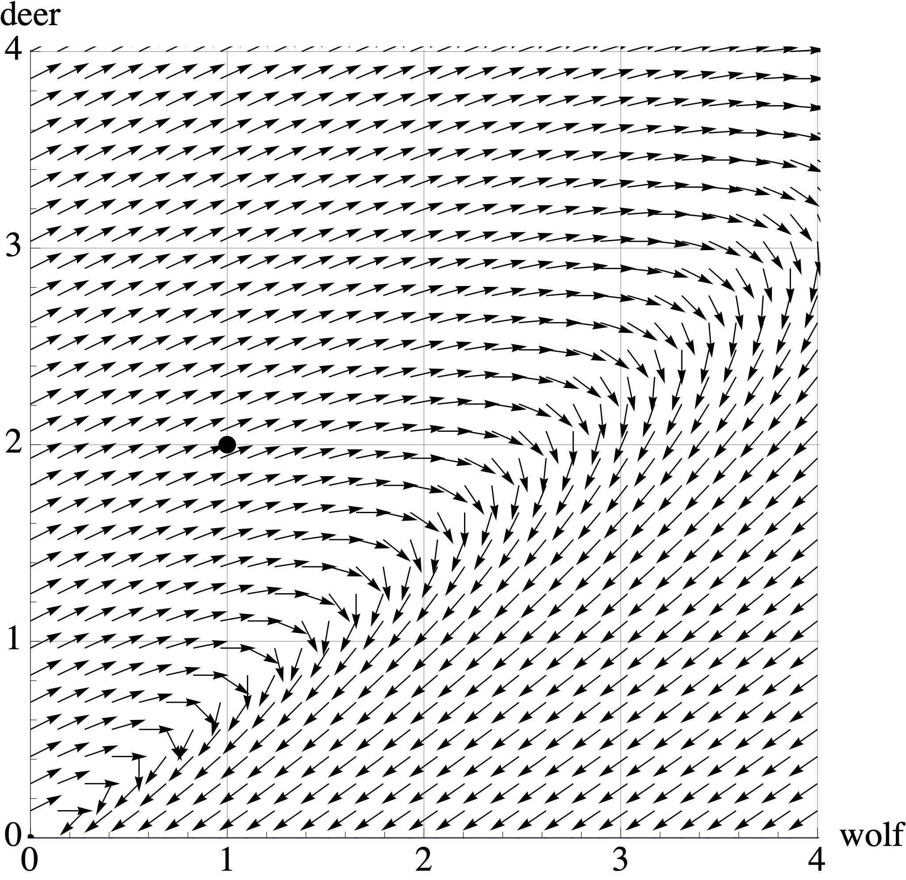

# Quiz 3 Review


## Overview

Our third quiz covers sections 5.1-5.3  and 5.5-5.6 in Lay's book. This corresponds to Problem Sets 6 and 7.

The best way to study is to do practice problems. The Quiz will have calculation problems (like Edfinity) and more conceptual problems (like the problem sets). Here are some ways to practice:

* Make sure that you have mastered the Vocabulary, Skills and Concepts  listed below.
* Look over the Edfinity homework assingments
* Do practice problems from the Edfinity Practice assignments. These allow you to "Practice Similar" by generating new variations of the same problem.
* Try to resolve the Problem Sets and compare your answers to the solutions.
* Do the practice problems below. Compare your answers to the solutions.

### Vocabulary, Concepts and Skills

See the [Week 5-6 Learning Goals](week-5-6-learning-goals) for the list of vocabulary, concepts and skills.


## Practice Problems


1. Consider the $3 \times 3$ matrix
$$
A = 
\left[
\begin{array}{rrr}
2 & -1 & 0 \\
0 & 1 & 0 \\
-2 & 5 & -2 \\
\end{array}
\right]
$$
with characteristic equation 
$$
p(\lambda) = -(\lambda -1)(\lambda -2)(\lambda +2).
$$
Find the eigenvalues and corresponding eigenvectors for $A$.


2. Let $A$ be a $2 \times 2$ matrix. We view $A$ as a linear transformation from $\mathbb{R}^2$ to $\mathbb{R}^2$. Describe the eigenvalues for each of the following types of matrices.

    a. $A$ maps $\mathbb{R}^2$  onto a line through the origin
    a. $A$ is a reflection  of $\mathbb{R}^2$ about a line through the origin
    a. $A$ is a reflection  of $\mathbb{R}^2$ through the origin
    a.  $A$ is a horizontal shear


    
    
3. Below are the eigenvalues of four different $5 \times 5$ matrices.  For each, decide if the matrix is invertible  and if it is diagonalizable. 
Answer Yes, No or "Not enough information to determine this." 


    a. $A$ has eigenvalues $\lambda =  -4, -3,0,1, 2$
    a. $B$ has eigenvalues $\lambda = -3, -1, 1, \sqrt{2}, 8.$
    a. $C$  has eigenvalues $\lambda =  1, 2, 2, 7, 8.$
    a. $D$ has eigenvalues $\lambda =  -1, 0, 3,3, 10$


4. Here the diagonalization of a matrix:
 $$
 \mathsf{A}=\left[
\begin{array}{ccc}
 5 & 2 & -1 \\
 2 & 1 & 0 \\
 -1 & 0 & 1 \\
\end{array}
\right] = 
\left[
\begin{array}{ccc}
 -5 & 0 & 1 \\
 -2 & 1 & -2 \\
 1 & 2 & 1 \\
\end{array}
\right] \left[
\begin{array}{ccc}
 6 & 0 & 0 \\
 0 & 1 & 0 \\
 0 & 0 & 0 \\
\end{array}
\right]\left[
\begin{array}{ccc}
 -\frac{1}{6} & -\frac{1}{15} & \frac{1}{30} \\
 0 & \frac{1}{5} & \frac{2}{5} \\
 \frac{1}{6} & -\frac{1}{3} & \frac{1}{6} \\
\end{array}
\right].
$$
    a. Is the matrix $\mathsf{A}$  invertible?
    b. Find a nonzero vector in $\mathrm{Nul}(\mathsf{A})$ if one exists.
    c. Find a steady-state vector $\mathsf{v}$ such that $\mathsf{A} \mathsf{v} = \mathsf{v}$ if one exists.
    d. Give the coordinates of $\mathsf{v} = [1,2,3]^T$ in the eigenbasis without row reductions.
    e. Find a formula for $\mathsf{A}^{2020} \mathsf{v}$ if $\mathsf{v} = [1,2,3]^T$ in terms of the eigenbasis.


5. The eigensystem of matrix  $A$ is given below.  It has complex eigenvalues. What angle  does it rotate by? What factor does it scale by?
$$
\begin{bmatrix} 3 & -5 \\ 1 & -1 \end{bmatrix}, \qquad
\lambda = 1 \pm i,
\qquad
v = \begin{bmatrix} 2 \\ 1 \end{bmatrix} \pm \begin{bmatrix} 1 \\ 0 \end{bmatrix} i.
$$


6.  Using the matrix $B = = \begin{bmatrix} .97 & -.71 \\ .71 & .97 \end{bmatrix}$  and the starting vector $\mathsf{v} = \begin{bmatrix} 1 \\ 0 \end{bmatrix}$, I plotted the points 
$$\mathsf{v}, B \mathsf{v}, B^2\mathsf{v}, B^3 \mathsf{v}, \ldots.$$ 
I saw that these points are, roughly, going around in a circle. 
    a. How many multiplications by $B$ does it take to get back around to the positive $x$-axis?   
    a. When I come full circle, am I closer to the origin, farther from the origin, or the same distance to the origin?  

7. For each matrix below,  decide if it is diagonalizable.  You do  not need to diagonalize the matrix (though you can!), but you must give a reason for why the matrix is or is not diagonalizable.

    a. $A = \begin{bmatrix} 0 & -4 & 2 \\ 2 & -4 & -1 \\ -6 & 4 & 7 \end{bmatrix}$ has eigenvalues $4, -1, 0$.

    b. $B = \begin{bmatrix} 3 & -1 & 2 \\ -1 & 3 & 2 \\ 2&2 & 0 \end{bmatrix}$ has eigenvalues $4,4,-2$.

 
 
 
 
8. Consider the matrix with  eigenvalues and eigenvectors
$$
A = \begin{bmatrix} 0.7 & 0.2 \\ 0.3 & 0.8 \end{bmatrix}
\qquad
\begin{array}{cc}
\lambda_1 = 1  & \lambda_2 = .5 \\
\mathsf{v}_1 = \begin{bmatrix} 2 \\ 3 \end{bmatrix} & \mathsf{v}_2 = \begin{bmatrix} 1 \\ -1 \end{bmatrix} 
\end{array}
$$

    a.  Diagonalize $A$.
    a. What can you say about $\displaystyle{\lim_{n \to \infty}} A^n$?
    a. Give a  formula for $A^n \mathsf{x}_0$ if $\mathsf{x}_0 = \begin{bmatrix} 25 \\ 0 \end{bmatrix}$ in terms of the eigenbasis.
    a. What is $\displaystyle{\lim_{n \to \infty}} A^n \begin{bmatrix} 25 \\ 0 \end{bmatrix}$?

 
9. The matrix $A$ below has the given eigenvalues and eigenvectors. 
$$
A = \left[
\begin{array}{cc}
 \frac{1}{2} & \frac{1}{5} \\
 -\frac{2}{5} & \frac{9}{10} \\
\end{array}
\right]
\qquad
\begin{array}{c}
\lambda = .7  \pm .2 i \\
\mathsf{v} = \begin{bmatrix} \frac{1}{2} \\ 1 \end{bmatrix} \pm   \begin{bmatrix} -\frac{1}{2} \\ 0 \end{bmatrix} i
\end{array}\hskip5in
$$ 

    a. Factor $A=PCP^{-1}$ where $C$ is a rotation-scaling matrix.
    a. What is the angle of rotation?
    a. What is the factor of dilation?

 
 

10. In a 1962 study of rainfall in Tel Aviv, it was determined that if today is a wet day, then the probability that tomorrow will be wet is 0.662 and the probability that tomorrow it will be dry is 0.338.  If today is a dry day, then the probability that tomorrow is wet is 0.250 and the probability that tomorrow is dry will be 0.75. From this I computed the following:
$$
A = \begin{bmatrix} 0.662 & 0.25 \\ 0.338 & 0.75\end{bmatrix};
\qquad
\begin{array}{cc}
 \lambda_1 = 1.0 & \lambda_2 = 0.412 \\
 \mathsf{v}_1 = \begin{bmatrix}-0.595 \\ -0.804 \end{bmatrix} & \quad \mathsf{v}_2 = \begin{bmatrix}-0.707\\ 0.707 \end{bmatrix}
 \end{array}
$$


    a.  If Monday is a dry day, what is the probability that Wednesday will be wet?
    a.  In the long-run, what is the distribution of wet and dry days?


11. Conservation biologists in the Minnesota boundary waters have modeled the predator-prey dynamics of  Grey Wolves $X$ and White Tailed Deer $Y$, which have a predator-prey relationship:
$$
\left[ 
\begin{array}{r} 
X_{t+1} \\ Y_{t+1} 
\end{array}
\right]
=
\left[ 
\begin{array}{rr} 
0.7 & 0.4 \\
-0.2 & 1.2
\end{array}
\right]
\left[ 
\begin{array}{r} 
X_{t} \\ Y_{t} 
\end{array}
\right]
\qquad \mbox{where} \qquad
X_0=1 \mbox{ and } Y_0=2. 
$$
Here, $t$ is measured in years and $X$ and $Y$ are measured in $100,000$ animals.


    a. The plot below  shows the vector field for this dynamical system. Draw or describe the trajectory of the populations starting at $[X_0, Y_0] = [1,2]$. In one or two sentences, describe what happens to these populations over time.
<center>
{width=60%}
</center>

    b. The population biologists consider two options to fix this system. The first option  is  a **deer breeding program** to increase their productivity. Their adjusted model becomes:
$$
\left[ 
\begin{array}{r} 
X_{t+1} \\ Y_{t+1} 
\end{array}
\right]
=
\left[ 
\begin{array}{rr} 
0.7 & 0.4 \\
-0.2 & 1.3
\end{array}
\right]
\left[ 
\begin{array}{r} 
X_{t} \\ Y_{t} 
\end{array}
\right]
$$
whose transition matrix has eigenvectors and eigenvalues
$$
\lambda_1 = 1.1  \mbox{ with eigenvector }  \begin{bmatrix} 1 \\ 1 \end{bmatrix} 
\quad \mbox{and} \quad
\lambda_2 = 0.9  \mbox{ with eigenvector }   \begin{bmatrix} 1 \\ 0.5 \end{bmatrix}. 
$$
<center>
{width=60%}
</center>
    Draw or describe the trajectory of the populations starting at $(X_0, Y_0) = (1,2)$ in the above vector plot. Describe what happens to these populations over time, and relate these observations to the eigenvectors and eigenvalues of the transition matrix.


    c. The second option they consider is a **limited wolf hunting season**. This reduces the productivity of the wolves, giving the new model: 
$$
\left[ 
\begin{array}{r} 
X_{t+1} \\ Y_{t+1} 
\end{array}
\right]
=
\left[ 
\begin{array}{rr} 
0.6 & 0.4 \\
-0.2 & 1.2
\end{array}
\right]
\left[ 
\begin{array}{r} 
X_{t} \\ Y_{t} 
\end{array}
\right]
$$
whose transition matrix has eigenvectors and eigenvalues
$$
\lambda_1 = 1  \mbox{ with eigenvector }  \begin{bmatrix} 1 \\ 1 \end{bmatrix}  \quad \mbox{and} \quad
\lambda_2 = 0.8 \mbox{ with eigenvector }   \begin{bmatrix} 1 \\ 0.5 \end{bmatrix} 
$$
<center>
{width=60%}
</center>
    Once again, draw or  desctibe the trajectory of the populations starting at $(X_0, Y_0) = (1,2)$ in the above vector plot. Describe what happens to these populations over time, and relate these observations to the eigenvectors and eigenvalues of the transition matrix.


    d. The conservation biologists want to create a stable ecosystem, where the populations of deer and wolves remain constant over time. Which option (deer breeding or limited wolf hunting) would you recommend?


12. A population of female bison is split into three groups: juveniles who are
less than one year old; yearlings between one and two years old; and adults who
are older than two years. Each year,
    * 80% of the juveniles survive to become yearlings.
    * 90% of the yearlings survive to become adults.
    * 80% of the adults survive.
    * 40% of the adults give birth to a juvenile
Let
$\mathsf{x}_t = \begin{bmatrix} J_t  \\ Y_t \\ A_t \end{bmatrix}$ be the
state of the system in year $t$.

    a. Find the Leslie matrix $L$ such that $\mathsf{x}_{t+1} = B \mathsf{x}_t.$.
    b. Find the eigenvalues of $L$.
    c. The matrix  $L$ has two complex eigenvalues and  one real eigenvalue. How  do  the complex eigenvectors manifest in the trajectory of a population?
    d. What is the long-term behavior of the herd? Will the size of the herd grow, stablilize  or shrink?  What will be the proportions of juveniles, yearlings and  adults in the herd?
 
## Solutions to Practice Problems

```{r}
require(pracma)
```


1.  There are three eigenvalues: 1, 2, and  $-2$. We find an eigenvector for each of  them.
    * Eigenvalue  $\lambda = 1$
    $$
    A - I = 
    \left[
    \begin{array}{rrr}
    1 & -1 & 0 \\
    0 & 0 & 0 \\
    -2 & 5 & -3 \\
    \end{array}
    \right]
    \sim
    \left[
    \begin{array}{rrr}
    1 & -1 & 0 \\
    0 & 3 & -3 \\
    0 & 0 & 0 \\
    \end{array}
    \right]
    \sim
    \left[
    \begin{array}{rrr}
    1 & -1 & 0 \\
    0 & 1 & -1 \\
    0 & 0 & 0 \\
    \end{array}
    \right]
    \sim
    \left[
    \begin{array}{rrr}
    1 & 0 & -1 \\
    0 & 1 & -1 \\
    0 & 0 & 0 \\
    \end{array}
    \right]
    $$
    So one eigenvector is $[1,1,1]^{\top}$


    * Eigenvalue $\lambda = 2$
    $$
    A - 2I = 
    \left[
    \begin{array}{rrr}
    0 & -1 & 0 \\
    0 & -1 & 0 \\
    -2 & 5 & -4 \\
    \end{array}
    \right]
    \sim
    \left[
    \begin{array}{rrr}
    -2 & 5 & -4 \\
    0 & -1 & 0 \\
    0 & 0 & 0 \\
    \end{array}
    \right]
    \sim
    \left[
    \begin{array}{rrr}
    -2 & 0 & -4 \\
    0 & 1 & 0 \\
    0 & 0 & 0 \\
    \end{array}
    \right]
    \sim
    \left[
    \begin{array}{rrr}
    1 & 0 & 2 \\
    0 & 1 & 0 \\
    0 & 0 & 0 \\
    \end{array}
    \right]
    $$
    So one eigenvector is $[-2,0,1]^{\top}$
  
    * Eigenvalue $\lambda = -2$
    $$
    A - 2I = 
    \left[
    \begin{array}{rrr}
    4 & -1 & 0 \\
    0 & 3 & 0 \\
    -2 & 5 & 0 \\
    \end{array}
    \right]
    \sim
    \left[
    \begin{array}{rrr}
    4 & 0 & 0 \\
    0 & 1 & 0 \\
    -2 & 0 & 0 \\
    \end{array}
    \right]
    \sim
    \left[
    \begin{array}{rrr}
    1 & 0 & 0 \\
    0 & 1 & 0 \\
    0 & 0 & 0 \\
    \end{array}
    \right]
    $$
    So one eigenvector is $[0,0,1]^{\top}$


2. 

    a. $\lambda=0$ is one eigenvalue. We know that the other eigenvalue is nonzero, since we are mapping onto  a line. However, we  can't say anything more without additional information.
  
    b. The eigenvalues are $\lambda_1 = 1$ and $\lambda_2=-1$. Let $L$ be the line of reflection.
        - If $\mathsf{v} = [a,b]^{\top}$ is on $L$, then $T(\mathsf{v}) = \mathsf{v}$.
        - The vector $\mathsf{w} = [-b,a]^{\top}$ is perpendicular to $L$, so $T(\mathsf{w}) = -\mathsf{w}$.
  
    c. The eigenvalues are $\lambda_1 = \lambda_2=-1$ because
    $$
    T\left( \begin{bmatrix} x_1 \\ x_2 \end{bmatrix} \right)
    = \begin{bmatrix} -x_1 \\ -x_2 \end{bmatrix}
    = \begin{bmatrix} -1 & 0 \\ 0 & -1 \end{bmatrix} \begin{bmatrix} x_1 \\ x_2 \end{bmatrix}
    $$
    d. There is one eigenvalue $\lambda=1$ with algebraic multiplicity 2. However, it only has geometric multiplicity 1. We know that a  shear matrix is not diagonalizable.
    

3.
    a. $A$ is not invertible because $0$ is an eigenvalue. $A$ is diagonalizable because it have 5 distinct eigenvalues.
    a. $B$ is  invertible because $0$ is not an eigenvalue. $B$ is diagonalizable because it have 5 distinct eigenvalues.
    a. $C$ is  invertible because $0$ is not an eigenvalue. We cannot tell whether $C$ is diagonalizable without more information. The eigenvalue $\lambda=2$ has algebraic multiplicity 2. We need to know whether the geometric multiplicity is 1 or 2.
    a. $D$ is not invertible because $0$ is  an eigenvalue. We cannot tell whether $D$ is diagonalizable without more information. The eigenvalue $\lambda=3$ has algebraic multiplicity 2. We need to know whether the geometric multiplicity is 1 or 2.
  
4.
    a. No, $A$ is not invertible because $0$ is an eigenvalue.
    b. $\mathsf{v} = [1, -2, 1]^{\top}$ is an eigenvector for $\lambda=0$. Therefore $\mathsf{v} \in \mbox{Nul}(A)$.
    c. THe vector $\mathsf{v} = [0,1,2]^{\top}$ is an eigenvector for $\lambda=1$. So this is a steady-state vector. (However, the dynamical system will not converge to this steady state because $\lambda=6$ is the dominant eigenvalue.)
    d. When $A=P D P^{-1}$, we can find the coordinates of a vector with respect to the eigenbasis via multiplication by $P^{-1}$.
  
```{r}
Pinv =cbind(c(-1/6,0,1/6),c(-1/15,1/5,-1/3),c(1/30,2/5,1/6))
v = c(1,2,3)

Pinv %*% v
```

  So  $[ \mathsf{v}]_{\mathcal{B}} = [-1/5, 8/5, 0]^{\top}$.


  e. $-\frac{1}{5} \cdot 6^{2000} \cdot \begin{bmatrix} -5 \\ -2 \\ 1 \end{bmatrix}  + \frac{8}{5}  \cdot \begin{bmatrix} 0 \\ 1 \\ 2 \end{bmatrix}$
  
  
5. This system scales by $\sqrt{1+1} = \sqrt{2}$ and it rotates by $\tan^{-1} (1/1) = \pi/4$. 

6. We have
$$
\begin{bmatrix} a & -b \\ b & a \end{bmatrix} = \begin{bmatrix} .97 & -.71\\ .71 & .97 \end{bmatrix} 
$$

Let's turn to RStudio
```{r, echo=TRUE}
a = .97
b = .71

scale = sqrt(a^2+b^2)
angle = atan (.97/.71)

scale
angle

2 * pi / angle
```

  a. It takes 7 iterations to rotate past the $x$-axis. 
  b. We are further from the origin because $| \lambda| \approx 1.2 > 1$.


7. 
    a. The matrix $A$ is diagonalizable because it has 3 distinct eigenvalues
    b. We must see whether $\lambda=4$ has geometric multiplicty 2 (to match its algebraic multiplicity).

```{r, echo=TRUE}
rref( cbind(c(-1,-1,2), c(-1,-1,2), c(2,2,-4)))
```

    We see that $B - 4I$ has two free columns, so $\dim ( \mbox{Nul}(B-4I))=2$. THis menas that $\lambda=4$ has geometric multiplicity 2. Therefore $B$ is diagonalizable.

8. 
    a. Taking $P = \begin{bmatrix} 2 & 1 \\ 3 & -1 \end{bmatrix}$, we have
$$
P^{-1} = \frac{1}{0.5} \begin{bmatrix} 0.8 & -0.2 \\ -0.3 & 0.7\end{bmatrix} = \begin{bmatrix} 1.6 & -0.4 \\ -0.6 & 1.4 \end{bmatrix}.
$$
    Therefore 
$$
A = \begin{bmatrix} 0.7 & 0.2 \\ 0.3 & 0.8 \end{bmatrix} = 
\begin{bmatrix} 2 & 1 \\ 3 & -1 \end{bmatrix}
\begin{bmatrix} 1 & 0 \\ 0 & 0.5 \end{bmatrix}
\begin{bmatrix} 1.6 & -0.4 \\ -0.6 & 1.4 \end{bmatrix}
$$

    b. $\lim_{n \rightarrow \infty} A^n = \begin{bmatrix} 2 & 1 \\ 2 & 1 \end{bmatrix}$ because $\lambda=1$ is the dominant eigenvalue.
  
    c. We need to find the coefficients for $x_0 = [25, 0]^{\top}$.

```{r}
P = cbind(c(2,3), c(1,-1))
v = c(25,0)
solve(P,v)
```

    So the formula is
$$
5 \begin{bmatrix} 2 \\ 3 \end{bmatrix} + \left( \frac{1}{2}  \right)^n \begin{bmatrix} 1 \\ -1 \end{bmatrix} 
$$
    
    d. This converges to $5 \begin{bmatrix} 2 \\ 3 \end{bmatrix}$.

9. 
    a.  We have
$$
A = \left[
\begin{array}{cc}
 \frac{1}{2} & \frac{1}{5} \\
 -\frac{2}{5} & \frac{9}{10} \\
\end{array}
\right]
=
\begin{bmatrix}
-1/2 & 1/2 \\ 0 & 1
\end{bmatrix}
\begin{bmatrix}
-0.7 & -0.2 \\ 0.2 & 0.7
\end{bmatrix}
\begin{bmatrix}
-2 & 1 \\ 0 & 1
\end{bmatrix}
$$

    b. THe angle of rotation is $tan^{-1} (.7/.2) = 1.29 radians
    c. The dilation factor is $\sqrt{0.49 + 0.4} = \sqrt{0.55}$.

  
10. Let's use RStudio.

```{r}
A = cbind(c(0.662, 0.338),c(0.25,  0.75))
A %*% A %*% c(0,1)

v1 = c(-0.595, -0.804 )
v1/sum(v1)
```

  a. If Monday is dry, then  the probability of a wet Wednesday is $0.353$.
  b. In the long run, $42.5\%$ of days are wet  and $57.5\%$ of days are dry.

11.
    a. Initially, both populations increase from $[1, 2]$ to $[2.25,2.5], with wolves increasing more quickly. The wolves continue to increase, while the deer start to decrease. After reachaing $[3,2]$, both populations decrease. The deer die out first at the point $[.8,0]$.
    b. Deer breeding: Both populations thrive and grow every year, converging slowly to a $1:1$ ratio. The long-term growth rate is $1.1$, or $10\%$ growth.
    c. Wolf hunting: Once again, both populations increase. But this time we converge on a stable population of about $[2.5, 2.5]$.
    d. Since they want a stable ecosystem, the wolf hunting is a better option. Ww reach a stable equilibrium population of $[2.5, 2.5]$

12. 

    a. Here is the Leslie matrix, as well as some eigensystem computations.
```{r, echo=TRUE}

L = cbind(c(0,.8,0),c(0,0,.9),c(.4,0,.8))
L

syst = eigen(L)

syst


syst$vectors[,1] / sum(syst$vectors[,1])

```

  b. The eigenvalues are $1.058, -0.129 \pm 0.506 i$.
  c. If we start outside of the span of the dominant eigenvalue, then the trajectory will wiggle with a mild oscillation with an overall growth trend of $1.058$, or $5.8\%$.
  d. The size of the herd grows. THe proportions are $[0.227, 0.172, 0.601]$.


